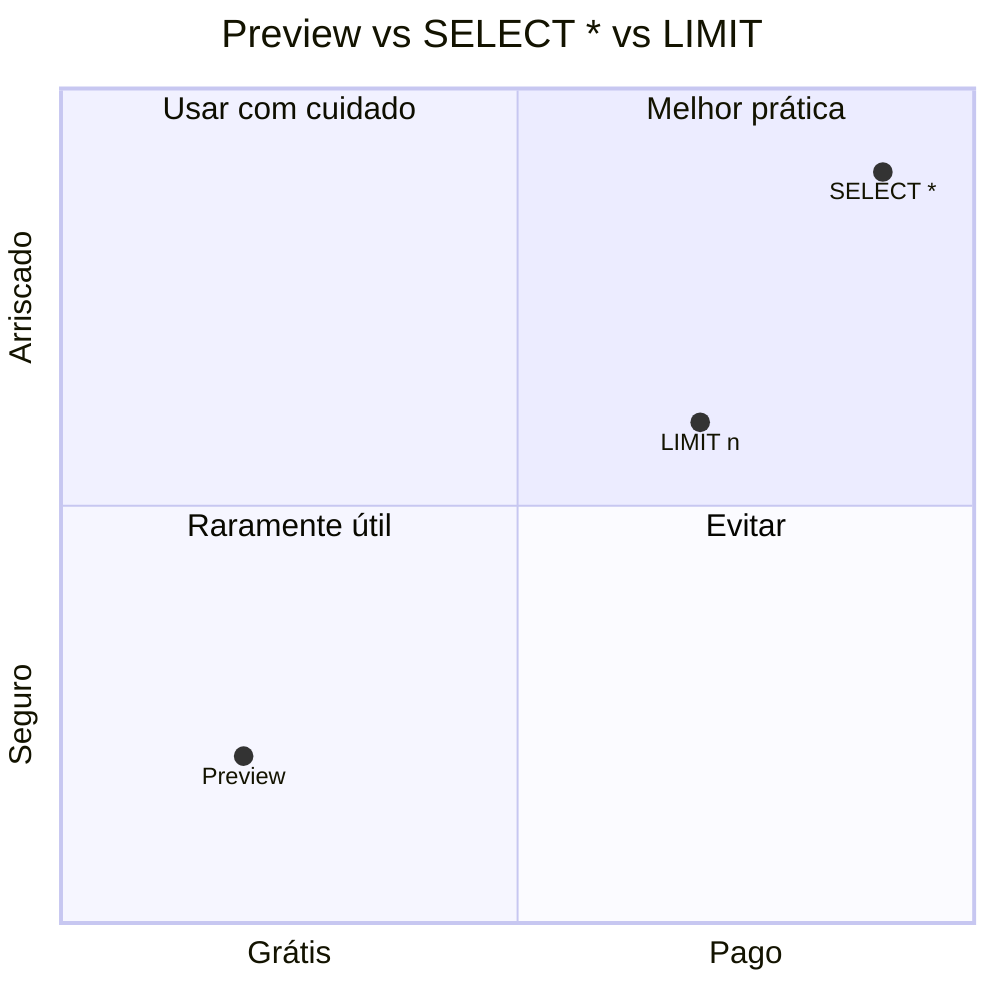

# Otimização de Consultas no BigQuery

## Como o BigQuery Cobra

O custo é baseado em **bytes processados** por consulta (exceto no plano flat-rate com slots dedicados).

| Modo | Custo |
|------|-------|
| On-demand (padrão) | US$ 5,00 por TB processado (primeiro 1 TB/mês grátis) |
| Flat-rate | Slots reservados (independe do volume) |

## 1. Evite SELECT *

```sql
-- RUIM: processa TODAS as colunas da tabela
SELECT * FROM `projeto.contabilidade.lancamentos`;

-- BOM: processa apenas colunas necessárias
SELECT
  data_lancamento,
  conta_contabil,
  valor
FROM `projeto.contabilidade.lancamentos`;
```

### Impacto Real

| Tabela | Colunas | SELECT * (bytes) | SELECT colunas específicas | Redução |
|--------|---------|------------------|---------------------------|---------|
| `lancamentos` | 50 colunas | 5 TB | 120 GB | **~97%** |

## 2. Use Aproximações para Grandes Volumes

`APPROX_COUNT_DISTINCT` é ordens de magnitude mais rápido que `COUNT(DISTINCT)` com erro < 2%:

```sql
-- Lento: conta distintos exatos
SELECT COUNT(DISTINCT cliente_id) FROM `projeto.faturamento.itens`;

-- Rápido: aproximação
SELECT APPROX_COUNT_DISTINCT(cliente_id) FROM `projeto.faturamento.itens`;
```

| Função Exata | Função Aproximada | Precisão |
|-------------|-------------------|----------|
| `COUNT(DISTINCT x)` | `APPROX_COUNT_DISTINCT(x)` | ~98% |
| `PERCENTILE_CONT(x, 0.5)` | `APPROX_QUANTILES(x, 100)[OFFSET(50)]` | ~98% |
| `COUNTIF(x > 0)` | — | Não há equivalente |

## 3. Caching e Reutilização

BigQuery faz cache dos resultados por **~24h** (para consultas idênticas). Não há custo para consultas em cache.

```sql
-- Primeira execução: processa dados (custa)
SELECT SUM(valor) FROM `projeto.contabilidade.lancamentos`
WHERE data_lancamento >= '2025-01-01';

-- Segunda execução (idêntica): resultado do cache (grátis)
SELECT SUM(valor) FROM `projeto.contabilidade.lancamentos`
WHERE data_lancamento >= '2025-01-01';
```

### Requisitos para Cache

- Consulta **exatamente idêntica** (inclusive espaços)
- Tabelas de origem **não** foram modificadas
- Resultado < ~10 GB
- Não usou funções não-determinísticas (`CURRENT_TIMESTAMP`, `RAND`, etc.)

## 4. Filtros Efetivos e Prunning de Partições

```sql
-- RUIM: sem filtro de partição (varre tudo)
SELECT SUM(valor)
FROM `projeto.contabilidade.lancamentos_part`
WHERE YEAR(data_lancamento) = 2025;

-- BOM: filtra pela coluna de partição
SELECT SUM(valor)
FROM `projeto.contabilidade.lancamentos_part`
WHERE data_lancamento BETWEEN '2025-01-01' AND '2025-12-31';
```

## 5. Clusterização para Filtros Específicos

```sql
-- Consulta em tabela clusterizada por empresa
SELECT SUM(valor)
FROM `projeto.contabilidade.lancamentos_part`
WHERE empresa = 'MATRIZ'
  AND data_lancamento BETWEEN '2025-01-01' AND '2025-01-31';
```

Com clusterização por `empresa`, BigQuery lê **apenas blocos da empresa MATRIZ** dentro da partição.

## 6. Before & After: Exemplo Prático

### Antes (sem otimização)

```sql
-- ~10 TB processados · ~US$ 50,00
SELECT
  empresa,
  conta_contabil,
  DATE(data_lancamento),
  SUM(valor)
FROM `projeto.contabilidade.lancamentos_raw`
WHERE YEAR(data_lancamento) >= 2024
  AND LENGTH(historico) > 0
GROUP BY empresa, conta_contabil, DATE(data_lancamento)
ORDER BY empresa, conta_contabil, data_lancamento;
```

### Depois (otimizado)

```sql
-- ~120 GB processados · ~US$ 0,60
SELECT
  empresa,
  conta_contabil,
  data_lancamento,
  SUM(valor) AS total
FROM `projeto.contabilidade.lancamentos_part`
WHERE data_lancamento >= '2024-01-01'
  AND historico IS NOT NULL
  AND historico != ''
GROUP BY empresa, conta_contabil, data_lancamento
ORDER BY empresa, conta_contabil, data_lancamento;
```

### O que mudou

| Técnica | Antes | Depois |
|---------|-------|--------|
| Tabela | Sem partição | Particionada + clusterizada |
| Filtro de data | `YEAR()` | Range direto na coluna |
| Filtro de texto | `LENGTH(hist>0)` | `IS NOT NULL AND != ''` |
| Colunas | `*` implícito | Apenas 4 colunas |
| Custo | US$ 50,00 | **US$ 0,60 (~98% menor)** |

## 7. Uso de Slots e Concorrência

- **On-demand:** até 2.000 slots por projeto (compartilhados)
- **Flat-rate:** slots dedicados (previsível)
- Consultas longas (> 6h) ou que consomem > 1 slot por 6h podem falhar

```sql
-- Ver uso de slots na última hora
SELECT
  job_id,
  query,
  total_slot_ms,
  TIMESTAMP_DIFF(end_time, start_time, SECOND) AS duracao_segundos,
  total_bytes_processed / POW(1024, 4) AS terabytes_processados
FROM `region-us.INFORMATION_SCHEMA.JOBS_BY_PROJECT`
WHERE EXTRACT(DATE FROM creation_time) = CURRENT_DATE()
ORDER BY total_slot_ms DESC
LIMIT 20;
```

## 8. INFORMATION_SCHEMA — Monitoramento de Custos

```sql
-- Top 10 consultas mais caras do dia
SELECT
  job_id,
  user_email,
  query,
  total_bytes_processed / POW(1024, 4) AS terabytes_processados,
  ROUND(total_bytes_processed / POW(1024, 4) * 5, 2) AS custo_estimado_usd,
  TIMESTAMP_DIFF(end_time, start_time, SECOND) AS duracao_segundos,
  state
FROM `region-us.INFORMATION_SCHEMA.JOBS_BY_PROJECT`
WHERE EXTRACT(DATE FROM creation_time) = CURRENT_DATE()
ORDER BY total_bytes_processed DESC
LIMIT 10;
```

```sql
-- Estimar custo de consultas por usuário no mês
SELECT
  user_email,
  COUNT(*) AS consultas,
  SUM(total_bytes_processed) / POW(1024, 4) AS total_tb,
  ROUND(SUM(total_bytes_processed) / POW(1024, 4) * 5, 2) AS custo_estimado_usd
FROM `region-us.INFORMATION_SCHEMA.JOBS_BY_PROJECT`
WHERE EXTRACT(YEAR_MONTH FROM creation_time) = 202501
GROUP BY user_email
ORDER BY custo_estimado_usd DESC;
```

## 9. Preview vs Query

Sempre use **Preview** (visualização de amostra) em vez de `SELECT * LIMIT n`:

- **Preview:** gratuito, amostra de ~10 MB
- `SELECT * LIMIT 1000`: pode processar a tabela inteira antes de aplicar o LIMIT



## 10. Boas Práticas Resumidas

| Prática | Impacto |
|---------|---------|
| Selecionar apenas colunas necessárias | Redução drástica de bytes |
| Filtrar por partição | Elimina varredura de meses/anos |
| Usar clustering em colunas filtradas | Reduz blocos lidos dentro da partição |
| Preferir `INNER JOIN` a `CROSS JOIN` | Evita explosão de linhas |
| Usar `EXISTS` em vez de `LEFT JOIN ... IS NULL` | Melhor para semijunções |
| Evitar `DISTINCT` desnecessário | Preferir `GROUP BY` |
| Usar `APPROX_*` em data lakes | Redução de 10-100x no custo |
| Materializar subconsultas frequentes em CTEs ou tabelas | Evita reprocessamento |
