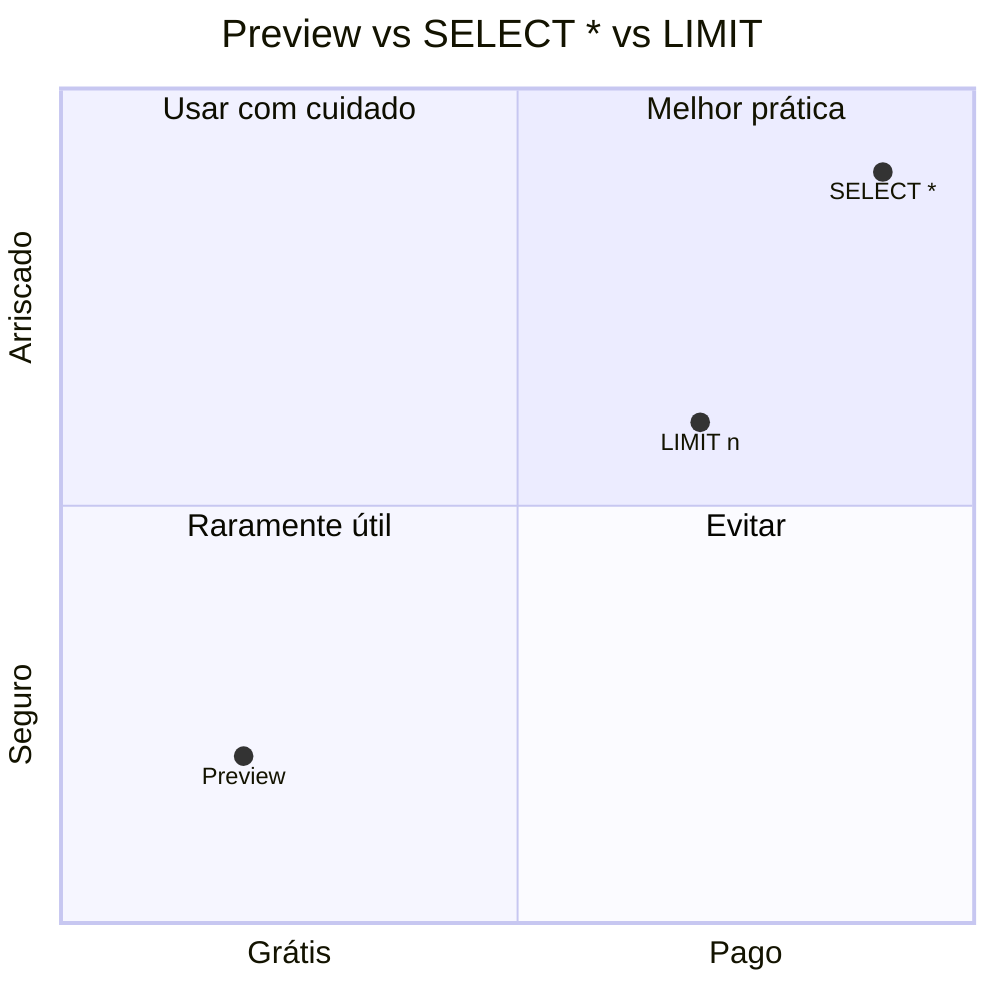

# Otimização de Consultas no BigQuery

Imagine que você foi ao supermercado, encheu o carrinho, passou no caixa, e o total deu R$ 500. Aí você olha a nota fiscal e percebe: 80% do que está ali você nem precisava. Frustrante, né?

No BigQuery é a mesma coisa: cada consulta gera uma "conta". Se você pedir dados desnecessários, paga por eles. A boa notícia: com técnicas simples, você pode reduzir sua conta em **90% a 98%**.

## Por que isso importa para você?

Na controladoria, você não quer gastar o orçamento de TI com consultas SQL desnecessárias. Cada dólar economizado em processamento pode ser usado em mais análises. E o chefe financeiro vai adorar ver que você sabe controlar custos até no banco de dados.

## Como o BigQuery Cobra

O custo é baseado em **bytes processados** por consulta (exceto no plano flat-rate com slots dedicados).

| Modo | Custo | Tradução |
|---|---|---|
| On-demand (padrão) | US$ 5,00 por TB processado (primeiro 1 TB/mês grátis) | "Pague pelo que usar" |
| Flat-rate | Slots reservados (independe do volume) | "Assinatura mensal" |

:::note O que é 1 TB?
1 TB (terabyte) = 1.000 GB. Uma tabela com 10 milhões de lançamentos contábeis (com ~20 colunas cada) ocupa aproximadamente 1 TB. Ou seja: sua primeira consulta pesada do mês é grátis.
:::

## 1. Evite SELECT * — O Erro Mais Caro

**Regra de ouro:** Só peça as colunas que você realmente precisa.

```sql
-- RUIM: processa TODAS as colunas da tabela (caro!)
SELECT * FROM `projeto.contabilidade.lancamentos`;

-- BOM: processa apenas colunas necessárias (barato)
SELECT
  data_lancamento,
  conta_contabil,
  valor
FROM `projeto.contabilidade.lancamentos`;
```

:::caution O impacto real
| Tabela | Colunas | SELECT * (bytes) | SELECT específico | Redução |
|---|---|---|---|---|
| `lancamentos` | 50 colunas | 5 TB | 120 GB | **~97%** |

R$ 25,00 → R$ 0,60 por consulta. Você prefere pagar 25 dólares ou 60 centavos?
:::

## 2. Use Aproximações para Grandes Volumes

Quando você só precisa de uma **estimativa** (não do valor exato), as funções de aproximação são muito mais rápidas:

```sql
-- Lento: conta distintos exatos
SELECT COUNT(DISTINCT cliente_id) FROM `projeto.faturamento.itens`;

-- Rápido: aproximação (erro < 2%)
SELECT APPROX_COUNT_DISTINCT(cliente_id) FROM `projeto.faturamento.itens`;
```

| Função Exata | Função Aproximada | Precisão | Quando usar |
|---|---|---|---|
| `COUNT(DISTINCT x)` | `APPROX_COUNT_DISTINCT(x)` | ~98% | "Quantos clientes diferentes compraram?" |
| `PERCENTILE_CONT(x, 0.5)` | `APPROX_QUANTILES(x, 100)[OFFSET(50)]` | ~98% | "Qual a mediana de gasto?" |
| `COUNTIF(x > 0)` | — | Não há equivalente | Use a função exata |

:::tip Quando usar aproximação?
Para relatórios gerenciais, dashboards e tendências, 98% de precisão é mais que suficiente. Para balanços fiscais e demonstrações oficiais, use os valores exatos.
:::

## 3. Cache — Consultas Grátis na Segunda Vez

BigQuery guarda o resultado das consultas por aproximadamente **24 horas**. Se você rodar a mesma consulta de novo, o resultado vem do cache — **grátis e instantâneo**.

```sql
-- Primeira execução: processa dados (custa)
SELECT SUM(valor) FROM `projeto.contabilidade.lancamentos`
WHERE data_lancamento >= '2025-01-01';

-- Segunda execução (idêntica): resultado do cache (grátis!)
SELECT SUM(valor) FROM `projeto.contabilidade.lancamentos`
WHERE data_lancamento >= '2025-01-01';
```

### Requisitos para o Cache Funcionar

A consulta precisa ser **exatamente idêntica** — incluindo espaços, maiúsculas/minúsculas. Além disso:
- Tabelas de origem **não** podem ter sido modificadas
- Resultado deve ser < ~10 GB
- Não pode usar funções como `CURRENT_TIMESTAMP`, `RAND()` (resultado muda a cada execução)

## 4. Filtros Efetivos — Filtre pela Coluna Certa

A forma como você filtra faz **toda** diferença:

```sql
-- RUIM: sem filtro de partição (varre a tabela INTEIRA)
SELECT SUM(valor)
FROM `projeto.contabilidade.lancamentos_part`
WHERE YEAR(data_lancamento) = 2025;

-- BOM: filtra pela coluna de partição diretamente
SELECT SUM(valor)
FROM `projeto.contabilidade.lancamentos_part`
WHERE data_lancamento BETWEEN '2025-01-01' AND '2025-12-31';
```

:::warning Por que YEAR(data_lancamento) é ruim?
Quando você usa `YEAR(data_lancamento)`, o BigQuery precisa ler a coluna `data_lancamento` de **todas as linhas** para extrair o ano e depois filtrar. Quando você usa `data_lancamento BETWEEN`, ele vai direto na partição. A diferença pode ser de **12x** mais dados processados.
:::

## 5. Clusterização — Filtros Específicos Dentro da Partição

```sql
-- Consulta em tabela clusterizada por empresa
SELECT SUM(valor)
FROM `projeto.contabilidade.lancamentos_part`
WHERE empresa = 'MATRIZ'
  AND data_lancamento BETWEEN '2025-01-01' AND '2025-01-31';
```

Com clusterização por `empresa`, BigQuery lê **apenas os blocos da MATRIZ** dentro da partição de janeiro.

## 6. Antes e Depois — Caso Real

### Antes (sem otimização)

```sql
-- ~10 TB processados · ~US$ 50,00
SELECT
  empresa,
  conta_contabil,
  DATE(data_lancamento),
  SUM(valor)
FROM `projeto.contabilidade.lancamentos_raw`
WHERE YEAR(data_lancamento) >= 2024
  AND LENGTH(historico) > 0
GROUP BY empresa, conta_contabil, DATE(data_lancamento)
ORDER BY empresa, conta_contabil, data_lancamento;
```

### Depois (otimizado)

```sql
-- ~120 GB processados · ~US$ 0,60
SELECT
  empresa,
  conta_contabil,
  data_lancamento,
  SUM(valor) AS total
FROM `projeto.contabilidade.lancamentos_part`
WHERE data_lancamento >= '2024-01-01'
  AND historico IS NOT NULL
  AND historico != ''
GROUP BY empresa, conta_contabil, data_lancamento
ORDER BY empresa, conta_contabil, data_lancamento;
```

### O que mudou — e quanto economizou

| Técnica | Antes | Depois | Economia |
|---|---|---|---|
| Tabela | Sem partição | Particionada + clusterizada | Varre só o necessário |
| Filtro de data | `YEAR()` | Range direto na coluna | Usa partição |
| Filtro de texto | `LENGTH(historico)>0` | `IS NOT NULL AND != ''` | Mais eficiente |
| Colunas | `*` implícito | Apenas 4 colunas | Menos bytes |
| **Custo** | **US$ 50,00** | **US$ 0,60** | **~98% menor** |

## 7. Uso de Slots e Concorrência

- **On-demand:** até 2.000 slots por projeto (compartilhados entre todos os usuários)
- **Flat-rate:** slots dedicados (custo previsível, mas maior)
- Consultas muito longas (> 6h) ou que consomem recursos demais podem falhar

```sql
-- Ver uso de slots na última hora
SELECT
  job_id,
  query,
  total_slot_ms,
  TIMESTAMP_DIFF(end_time, start_time, SECOND) AS duracao_segundos,
  total_bytes_processed / POW(1024, 4) AS terabytes_processados
FROM `region-us.INFORMATION_SCHEMA.JOBS_BY_PROJECT`
WHERE EXTRACT(DATE FROM creation_time) = CURRENT_DATE()
ORDER BY total_slot_ms DESC
LIMIT 20;
```

## 8. INFORMATION_SCHEMA — Monitorando Custos

Quer saber quem está gastando mais? Quanto cada consulta custou? Use estas consultas:

```sql
-- Top 10 consultas mais caras do dia
SELECT
  job_id,
  user_email,
  query,
  total_bytes_processed / POW(1024, 4) AS terabytes_processados,
  ROUND(total_bytes_processed / POW(1024, 4) * 5, 2) AS custo_estimado_usd,
  TIMESTAMP_DIFF(end_time, start_time, SECOND) AS duracao_segundos,
  state
FROM `region-us.INFORMATION_SCHEMA.JOBS_BY_PROJECT`
WHERE EXTRACT(DATE FROM creation_time) = CURRENT_DATE()
ORDER BY total_bytes_processed DESC
LIMIT 10;
```

```sql
-- Estimar custo de consultas por usuário no mês
SELECT
  user_email,
  COUNT(*) AS consultas,
  SUM(total_bytes_processed) / POW(1024, 4) AS total_tb,
  ROUND(SUM(total_bytes_processed) / POW(1024, 4) * 5, 2) AS custo_estimado_usd
FROM `region-us.INFORMATION_SCHEMA.JOBS_BY_PROJECT`
WHERE EXTRACT(YEAR_MONTH FROM creation_time) = 202501
GROUP BY user_email
ORDER BY custo_estimado_usd DESC;
```

:::tip Como usar isso na prática
Com essas consultas, você pode identificar qual usuário está fazendo consultas caras e orientá-lo. Ou simplesmente provar para seu chefe que você otimizou os custos em 90% neste mês.
:::

## 9. Preview vs Query

**Sempre** use **Preview** (visualização de amostra) em vez de `SELECT * LIMIT n`:

- **Preview:** gratuito, mostra uma amostra de ~10 MB
- `SELECT * LIMIT 1000`: pode processar a tabela INTEIRA antes de aplicar o LIMIT



## 10. Boas Práticas Resumidas

| Prática | Impacto no Custo |
|---|---|
| Selecionar apenas colunas necessárias | Redução drástica de bytes |
| Filtrar por partição | Elimina varredura de meses/anos |
| Usar clustering em colunas filtradas | Reduz blocos lidos dentro da partição |
| Preferir `INNER JOIN` a `CROSS JOIN` | Evita explosão de linhas |
| Usar `EXISTS` em vez de `LEFT JOIN ... IS NULL` | Melhor performance em semijunções |
| Evitar `DISTINCT` desnecessário | Preferir `GROUP BY` quando possível |
| Usar `APPROX_*` em análises gerenciais | Redução de 10-100x no custo |
| Materializar subconsultas frequentes | Evita reprocessamento dos mesmos dados |

> **Lembre-se:** Cada byte não processado é centavo economizado. E centavos viram reais no fim do mês.
