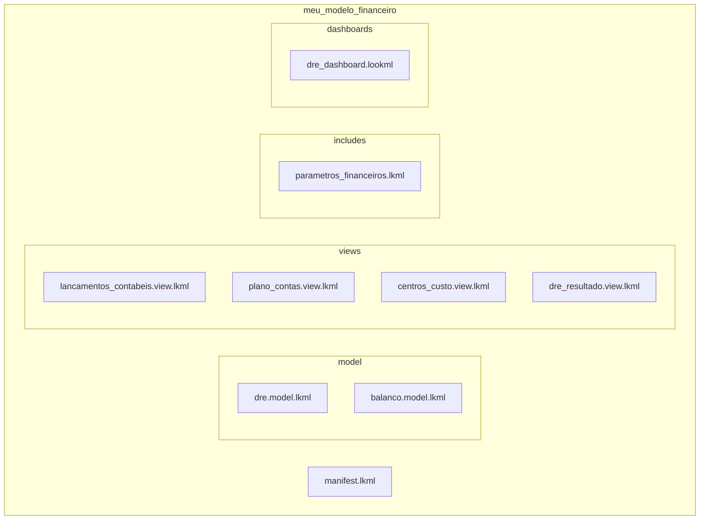

# LookML — Fundamentos

## O que é LookML?

LookML é a linguagem de modelagem semântica do Looker. É uma linguagem declarativa baseada em YAML que define:

- **O quê** os usuários podem consultar (dimensões, medidas)
- **Como** esses campos são calculados (SQL subjacente)
- **Relacionamentos** entre entidades (joins)
- **Regras de negócio** (filtros, hierarquias, agregações)

Todo o código LookML fica em um repositório Git — cada alteração é versionada, revisada e auditável.

## Estrutura do Projeto



## Arquivos `.view` — A Unidade Fundamental

Uma **view** representa uma tabela (ou uma CTE) e expõe seus campos como `dimensions` e `measures`.

### View: `lancamentos_contabeis`

```lookml
view: lancamentos_contabeis {
  sql_table_name: `projeto.controladoria.lancamentos_contabeis` ;;

  dimension: id_lancamento {
    type: number
    sql: ${TABLE}.id_lancamento ;;
    primary_key: yes
  }

  dimension: data_contabil {
    type: date
    sql: ${TABLE}.data_contabil ;;
  }

  dimension: id_conta {
    type: number
    sql: ${TABLE}.id_conta_contabil ;;
  }

  dimension: nome_conta {
    type: string
    sql: ${TABLE}.nome_conta ;;
  }

  dimension: id_centro_custo {
    type: number
    sql: ${TABLE}.id_centro_custo ;;
  }

  dimension: centro_custo {
    type: string
    sql: ${TABLE}.centro_custo ;;
  }

  dimension: tipo_conta {
    type: string
    sql: ${TABLE}.tipo_conta ;;  -- 'Receita', 'Despesa', 'Ativo', 'Passivo'
  }

  dimension: vlr_lancamento {
    type: number
    sql: ${TABLE}.valor ;;
  }

  dimension: natureza {
    type: string
    sql: ${TABLE}.natureza ;;    -- 'D' (débito) ou 'C' (crédito)
  }

  measure: total_lancamentos {
    type: count
    drill_fields: [id_lancamento, nome_conta, vlr_lancamento]
  }

  measure: valor_total {
    type: sum
    sql: ${vlr_lancamento} ;;
    value_format_name: brl
  }
}
```

## Arquivos `.explore` — Os Pontos de Entrada

O **explore** define como as views se relacionam e o que o usuário pode consultar.

```lookml
include: "/views/lancamentos_contabeis.view.lkml"
include: "/views/plano_contas.view.lkml"
include: "/views/centros_custo.view.lkml"

explore: dre_resultado {
  label: "DRE - Demonstrativo de Resultado"

  join: plano_contas {
    type: left_outer
    sql_on: ${lancamentos_contabeis.id_conta} = ${plano_contas.id_conta} ;;
    relationship: many_to_one
  }

  join: centros_custo {
    type: left_outer
    sql_on: ${lancamentos_contabeis.id_centro_custo} = ${centros_custo.id_centro_custo} ;;
    relationship: many_to_one
  }

  always_filter: {
    filters: {
      field: lancamentos_contabeis.tipo_conta
      value: "Receita", "Despesa"
    }
  }
}
```

## Parâmetros Essenciais

| Parâmetro | Função | Exemplo |
|---|---|---|
| `sql` | Define a expressão SQL do campo | `${TABLE}.valor` |
| `type` | Tipo do campo (`string`, `number`, `date`, `sum`, `count`) | `type: sum` |
| `sql_table_name` | Mapeia a view para uma tabela física | `` `projeto.dataset.tabela` `` |
| `primary_key` | Marca a chave primária | `primary_key: yes` |
| `drill_fields` | Define quais campos aparecem no drill-down | `drill_fields: [id, nome]` |
| `value_format_name` | Formato de exibição (ex.: `brl`, `percent_2`) | `value_format_name: brl` |
| `label` | Nome amigável exibido no Explorer | `label: "Centro de Custo"` |
| `description` | Descrição do campo (aparece no hover) | `description: "Código SAP do centro"` |
| `hidden` | Oculta o campo do Explorer | `hidden: yes` |

## Boas Práticas para Controladoria

1. **Nomenclatura consistente**: Use `pt-BR` para labels e inglês para nomes técnicos
2. **Documentação inline**: Use `description` em todos os campos financeiros
3. **Drill paths bem definidos**: DRE consolidada -> por centro de custo -> por lançamento
4. **Filtros obrigatórios**: Sempre exija `data_contabil` e `tipo_conta` para evitar consultas sem escopo
5. **Validação em dev**: Teste todo novo campo antes de promover para produção

---

**Próximo módulo:** [02-dimensoes-medidas.md](02-dimensoes-medidas.md) — Dimensões e Medidas Financeiras
