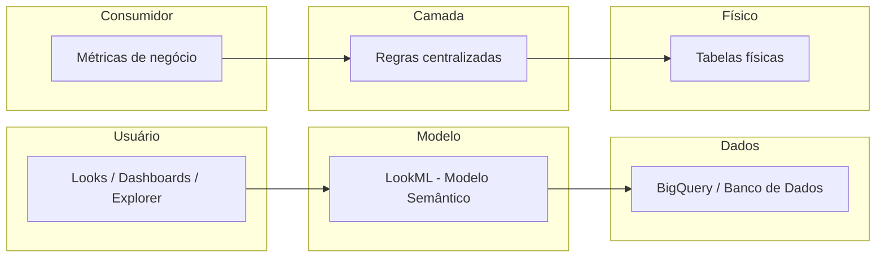

# Introdução ao Looker para Controladoria

## O que é o Looker?

Looker é uma plataforma de business intelligence e analytics da Google Cloud que adota uma abordagem baseada em **modelagem semântica**. Diferente de ferramentas tradicionais que operam diretamente sobre tabelas e SQL, o Looker utiliza uma camada intermediária — o LookML — que define as regras de negócio, métricas e relacionamentos de forma centralizada e reutilizável.

## Por que Looker para Finanças?

| Característica | Benefício para Controladoria |
|---|---|
| **Semantic Modeling** | Métricas financeiras (receita líquida, EBITDA, margem bruta) definidas uma única vez e consumidas por todos os relatórios |
| **Governança Centralizada** | Regras de reconhecimento, classification contábil e hierarquias de contas mantidas no LookML, não em planilhas |
| **Versionamento** | Todo o modelo fica em Git — auditoria completa de quem alterou o quê e quando |
| **Granularidade sob Demanda** | Drill from DRE consolidado até o lançamento individual sem escrever SQL |
| **Integração Nativa BigQuery** | Consultas em data warehouse serverless sem limites de escala |

## Looker vs. Tableau

| Aspecto | Looker | Tableau |
|---|---|---|
| **Abordagem** | Modelagem semântica (LookML) | Conexão direta / SQL ad-hoc |
| **Governança** | Centralizada, versionada em Git | Por workbook, difícil de padronizar |
| **Escalabilidade** | BigQuery por baixo — petabytes | Dependente do motor local |
| **Curva de aprendizado** | Maior (LookML exige aprendizado) | Menor (drag-and-drop) |
| **Público-alvo** | Equipes de dados + consumidores | Analistas individuais |
| **Controle de versão** | Nativo (LookML em Git) | Limitado |
| | **Melhor para controladoria** | **Melhor para análise exploratória** |

## A Camada Semântica

O diferencial central do Looker é que o usuário de negócio interage com *nomes de negócio* (ex.: "Receita Líquida", "Margem Bruta") e não com nomes de colunas físicas (`vlr_receita_bruta - vlr_deducoes`). A camada LookML traduz a terminologia financeira para SQL automaticamente.

```
Usuário                          Consumidor
   |                                  ↑
   ↓                                  |
[Looks / Dashboards / Explorer]   [Métricas de negócio]
   |                                  ↑
   ↓                                  |
[ LookML — Modelo Semântico ]     [Regras centralizadas]
   |                                  ↑
   ↓                                  |
[ BigQuery / Banco de Dados ]    [Tabelas físicas]
```



## Fluxo de Trabalho na Controladoria

1. **Engenheiro de dados** -> Modela tabelas no BigQuery (lançamentos, plano de contas, centros de custo)
2. **Analista de BI** -> Cria views e explores em LookML aplicando regras de negócio
3. **Contador / Controller** -> Constrói looks e dashboards no Explore (sem SQL)
4. **CFO / Diretoria** -> Consome dashboards programados, alertas e relatórios automatizados

---

**Próximo módulo:** [01-lookml.md](01-lookml.md) — Fundamentos do LookML
