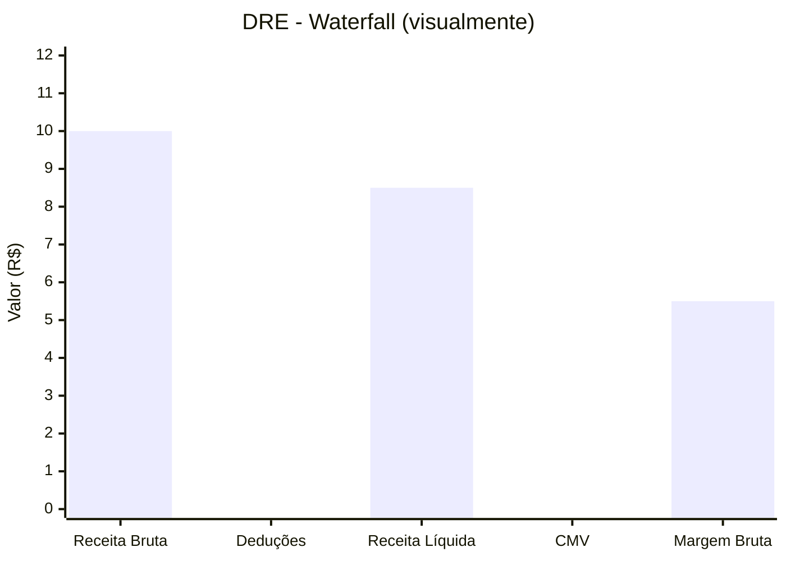

# Visualizações Financeiras no Tableau

> Imagine que você está apresentando o resultado do trimestre para o CFO. Em vez de passar 20 slides de tabelas, você mostra **um gráfico** que, em segundos, conta toda a história da DRE: "Começamos com R$ 10 milhões de receita, deduzimos R$ 1,5 milhão, pagamos o CMV... e chegamos a R$ 5,5 milhões de lucro." Este capítulo ensina você a criar esse tipo de visualização que *conta histórias financeiras*.

:::tip O que você vai aprender aqui
Cada gráfico abaixo resolve um problema real do seu dia a dia na controladoria. Não é teoria — é ferramenta de trabalho.
:::

## 1. Gráfico de Cascata (Waterfall) — A "Escada" da DRE

O gráfico waterfall é como uma **escada financeira**: cada degrau é uma linha da DRE, e você vê visualmente o resultado subindo ou descendo.

### Problema que resolve
O DRE tradicional é uma tabela chata de números. O waterfall mostra o **fluxo** visual: receita → custos → despesas → resultado. O olho humano entende muito mais rápido.

### Como construir no Tableau

**Passo 1** — Crie um campo para forçar a ordem certa da DRE:

```tableau
// Ordem DRE (campo calculado)
CASE [categoria_dre]
    WHEN 'Receita Bruta' THEN 1
    WHEN 'Deduções' THEN 2
    WHEN 'Receita Líquida' THEN 3
    WHEN 'CMV' THEN 4
    WHEN 'Margem Bruta' THEN 5
    WHEN 'Despesas Operacionais' THEN 6
    WHEN 'Resultado Financeiro' THEN 7
    WHEN 'IR/CSLL' THEN 8
    WHEN 'Lucro Líquido' THEN 9
END
```

**Passo 2** — Monte a visualização:

```tableau
3. Colunas: [ordem_dre] (discreto — para criar colunas separadas)
4. Linhas: RUNNING_SUM(SUM([valor])) (soma acumulada)
5. Marcas: Gráfico de Gantt (sim, o mesmo de cronograma de projetos!)
6. Tamanho: SUM([valor]) (quanto maior o valor, mais largo o degrau)
7. Cor: IIF(SUM([valor]) >= 0, "Positivo", "Negativo") (verde/azul = sobe, vermelho = desce)
```

:::caution Entendendo o truque
O tipo **Gantt** é normalmente usado para cronogramas. Aqui usamos um "jeitinho": a barra começa onde a anterior terminou (graças ao `RUNNING_SUM`), e o **Tamanho** define a altura de cada degrau. Resultado: o efeito cascata!
:::



:::note Na prática da controladoria
Com este gráfico, você responde na hora: "Onde está o gargalo?" Se o CMV está comendo muito da receita, a barra despenca e todo mundo vê. Muito mais eficaz que uma tabela de números.
:::

## 2. Receita vs Despesa — O "Cabo de Guerra" Mensal

### Problema que resolve
Sua receita está crescendo, mas as despesas também? Em quais meses a despesa "passa a frente"? Este gráfico mostra o cabo de guerra mês a mês.

### Como construir

```tableau
1. Colunas: MONTH([data]) como Contínuo (linha do tempo)
2. Linhas: SUM([valor])
3. Cor: [categoria_dre] (filtre marcando só "Receita" e "Despesa")
4. Marcas: Linha com pontos (cada categoria vira uma linha)
```

Para destacar o resultado líquido (receita - despesa) de cada mês:

```tableau
// Campo calculado: Resultado Líquido
SUM(IIF([categoria_dre] = 'Receita', [valor], 0)) -
SUM(IIF([categoria_dre] = 'Despesa', [valor], 0))
```

**Deixe mais profissional** — adicione uma linha de referência no zero:

```tableau
Análise → Linha de Referência → 
  Valor: 0 (no eixo)
  Rótulo: "Ponto de Equilíbrio"
  Cor: vermelha tracejada
```

> Agora, se a linha de resultado cair abaixo do zero, você vê na hora o mês que deu prejuízo.

## 3. Tendências de P&L — A "Evolução da DRE" no Tempo

### Problema que resolve
O diretor financeiro quer ver a evolução das principais linhas do DRE nos últimos 2 anos. Não em tabelas — em linhas que mostram visualmente para onde cada conta está caminhando.

### Como construir

```tableau
1. Colunas: MONTH([data]) Contínuo
2. Linhas: SUM([valor])
3. Filtro [ano]: marque 2024 e 2025
4. Cor: [categoria_dre] (escolha 4-5 categorias principais)
5. Marcas: Linha
6. Detalhe: [ano] para separar visualmente cada ano
```

:::tip Dica de formatação financeira
Números muito grandes (R$ 10.000.000) poluem o gráfico. Formate em **milhares**:

```tableau
Clique direito em SUM(valor) → Formatar → 
  Número → Personalizado: R$ #.##0,
  (a vírgula NO FINAL indica "dividir por mil")
```
:::

Que tal **prever o futuro**? O Tableau faz isso com 2 cliques:

```tableau
Análise → Previsão → Modelo Exponencial Suavizado
  Prever por: 3 meses
  Mostrar: Intervalo de Confiança (sombreado — a "área de incerteza")
```

:::warning Atenção!
Previsão no Tableau é baseada em padrões passados. Ela não substitui um orçamento formal — mas é ótima para identificar tendências rapidamente.
:::

## 4. Treemap — O "Raio-X" do Balanço Patrimonial

### Problema que resolve
Você precisa mostrar a composição do ativo e passivo em **um único olhar**. Qual conta é a maior? Quanto o caixa representa do total? Com um treemap, o tamanho do retângulo já diz tudo.

### Como construir

```tableau
1. Marcas: Mapa de Árvore (Treemap) — é um dos tipos de gráfico
2. Tamanho: SUM([valor]) (quanto maior o valor, maior o retângulo)
3. Cor: SUM([valor]) (escala divergente: azul = ativo, laranja = passivo)
4. Detalhe: [conta_contabil] (cada conta vira um retângulo)
5. Rótulo: [conta_contabil] + SUM([valor])
6. Filtro: [categoria_dre] contém "Ativo" ou "Passivo"
```

```mermaid
block-beta
  columns 4
  block:Ativo
    columns 2
    Caixa Contas_a_Receber
    Estoques Imobilizado
  end
  block:Passivo
    columns 2
    Fornecedores Dívidas
  end
end

> Treemap: caixa (ativo) ocupa área proporcional ao seu valor. Passivo aparece em laranja. Dá pra ver a estrutura patrimonial em 2 segundos.
```

## 5. Gráfico de Barras por Idade (Aging) — "Quanto Tempo Está Devendo?"

### Problema que resolve
Contas a receber/pagar precisam ser monitoradas por faixa de atraso. Quanto está vencido há mais de 90 dias? Este gráfico responde.

### Como construir

**Passo 1** — Crie um campo calculado que classifica cada conta por faixa de dias:

```tableau
// Faixa de Aging
IF DATEDIFF('day', [data_vencimento], TODAY()) <= 0 THEN 'A Vencer'
ELSEIF DATEDIFF('day', [data_vencimento], TODAY()) <= 30 THEN '1-30 dias'
ELSEIF DATEDIFF('day', [data_vencimento], TODAY()) <= 60 THEN '31-60 dias'
ELSEIF DATEDIFF('day', [data_vencimento], TODAY()) <= 90 THEN '61-90 dias'
ELSE '90+ dias'
END
```

**Passo 2** — Monte o gráfico:

```tableau
2. Colunas: [faixa_aging] (ordene manualmente: A Vencer, 1-30, 31-60...)
3. Linhas: SUM([saldo]) — quanto dinheiro está em cada faixa
4. Cor: [faixa_aging] (vermelho mais escuro = mais atrasado)
5. Rótulo: SUM([saldo]) formatado como R$
```

## 6. Sparklines — O "Coração" do Fluxo de Caixa

### Problema que resolve
Mostrar a tendência diária do saldo de caixa de forma **compacta** — sem eixos, sem números poluindo, só a "linha do coração" do seu fluxo.

### Como construir

```tableau
1. Colunas: DAY([data]) Contínuo
2. Linhas: SUM([saldo_diario])
3. Marcas: Linha (sem marcadores de ponto, sem eixos visíveis)
4. Filtro: Últimos 30 dias
5. Ocultar eixos: botão direito em cada eixo → Mostrar Cabeçalhos → desmarque
```

:::tip Dica de dashboard
Sparklines são perfeitas para **painéis executivos**. Coloque várias lado a lado (uma para cada conta) em containers com altura fixa de ~100px. Fica elegante e informativo.
:::

## 7. Bullet Chart — O "Termômetro" dos KPIs

### Problema que resolve
Comparar **realizado vs meta vs benchmark** em um único gráfico. É como o velocímetro do carro: você vê onde está, onde deveria estar, e qual a referência do mercado.

### Como construir

Sua tabela precisa ter esta estrutura:

```
  | kpi          | tipo     | valor |
  |--------------|----------|-------|
  | Margem Bruta | Real     | 0.32  |
  | Margem Bruta | Meta     | 0.35  |
  | Margem Bruta | Benchmark| 0.30  |
```

```tableau
2. Colunas: SUM([valor])
3. Linhas: [kpi] (cada KPI vira uma linha)
4. Duas camadas de barras:
   - Barra fina (atrás): meta + benchmark (cor cinza)
   - Barra grossa (frente): realizado (cor azul/verde)
5. Marcas principais: Barra (para o realizado)
6. Adicione linha de referência no valor da meta
```

:::note Na prática da controladoria
Um bullet chart de Margem Bruta que mostra Real=32%, Meta=35%, Benchmark=30% conta a história completa: "estamos abaixo da meta, mas acima do mercado". Em um único gráfico.
:::

## 8. Heatmap — O "Mapa de Calor" das Despesas

### Problema que resolve
Qual departamento gasta mais? E em qual mês? O heatmap responde com **cores**: quanto mais vermelho, maior o gasto.

### Como construir

```tableau
1. Colunas: MONTH([data]) (discreto — cada mês uma coluna)
2. Linhas: [departamento] (cada departamento uma linha)
3. Marcas: Quadrado (Square) — vira um mapa de calor
4. Cor: SUM([valor]) — escala de branco (gastou pouco) a vermelho (gastou muito)
5. Tamanho: SUM([valor]) — quadrado maior = mais gasto
6. Rótulo: SUM([valor]) (formatado como R$)
```

```
Resultado esperado: Uma matriz de quadrados coloridos.
Janeiro, departamento Financeiro → quadrado vermelho = gastou muito.
Junho, departamento TI → quadrado branco = gastou pouco.
```

> **Cor mais escura = maior despesa.** Você identifica padrões em segundos: "O Financeiro sempre gasta mais em março (fechamento de ano fiscal). A TI gasta mais em dezembro (compras de equipamento)."

## Exercícios Práticos

1. **Waterfall DRE completo**
   Construa o waterfall chart para o ano de 2025 usando a tabela `dre` do Grupo Nova Era. Ordene as categorias na sequência correta do DRE.

2. **Aging de contas a pagar**
   Use a tabela `contas_pagar` para criar um aging por fornecedor. Destaque em vermelho os fornecedores com saldo acima de R$ 100 mil em atraso > 90 dias.

3. **Painel de KPIs com bullet charts**
   Crie 4 bullet charts lado a lado: Margem Bruta, Margem Líquida, EBITDA, ROIC. Use os campos `meta` e `realizado` da tabela `orcamento`.

4. **Heatmap de despesas 2025**
   Filtre despesas operacionais e crie um heatmap departamento × mês. Adicione um filtro para selecionar apenas um trimestre.

---

## Resumo rápido — Visualizações Financeiras

| Problema | Gráfico | Quando usar |
|----------|---------|-------------|
| Mostrar composição da DRE | **Waterfall** (cascata) | Demonstrativo de resultado |
| Comparar receita vs despesa | **Linha dupla** | Evolução mensal |
| Evolução da DRE no tempo | **Linha com categorias** | P&L ao longo de meses |
| Composição do balanço | **Treemap** | Ativo vs Passivo |
| Contas por faixa de atraso | **Barras de aging** | Contas a receber/pagar |
| Tendência compacta | **Sparkline** | Fluxo de caixa em dashboards |
| Realizado vs Meta | **Bullet chart** | KPIs e metas |
| Padrões de gasto | **Heatmap** | Departamento × Mês |

**Próximo: [Cálculos e LOD](03-calculos-lod.md)**
