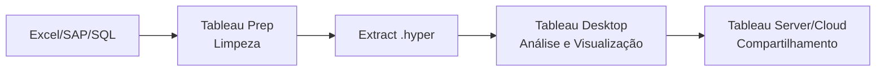

# Introdução ao Tableau para Controladoria

> Imagine que você está na reunião de resultados do comitê financeiro. O diretor pergunta: *"Qual foi a tendência da margem bruta nos últimos 6 meses?"* Enquanto você puxa planilhas, aplica filtros e soma colunas manualmente, passam-se 15 minutos. Com Tableau, você responde em 15 segundos — arrastando campos com o mouse. Esse é o poder que você vai dominar aqui.

## O que é o Tableau?

Tableau é uma plataforma de análise e visualização de dados — pense nela como **o Excel que enxerga**. Em vez de números em células, você vê cores, formas, linhas e barras que contam a história financeira do seu negócio.

Diferente de ferramentas tradicionais, o Tableau foi criado com uma filosofia *arraste-e-solte* (*drag-and-drop*): você não precisa programar para criar gráficos sofisticados. É como montar Lego: você pega as peças (campos de dados) e encaixa nos lugares certos.

:::tip Jargão traduzido
**Drag-and-drop** = arrastar e soltar. Você clica em um campo (ex: "Receita"), segura, arrasta para a área de desenho e solta. Pronto, o gráfico aparece.
:::

Para o profissional de controladoria, o Tableau preenche uma lacuna crítica:
- **Planilhas** são estáticas — você imprime e acabou
- **SQL** consulta dados mas não os explora visualmente
- **Power BI** exige todo um ecossistema Microsoft

O Tableau é o meio do caminho: agilidade na descoberta de insights financeiros sem burocracia técnica.

## Por que Tableau para Finanças?

:::note Na prática da controladoria
Seu dia a dia envolve DRE, balancete, fluxo de caixa, KPIs. Tableau transforma cada um desses em gráficos interativos que você pode navegar como um site — clicando, filtrando, explorando.
:::

| Funcionalidade | Traduzindo para seu dia a dia |
|----------------|------------------------------|
| Conectividade | Conecta direto no SQL da empresa, no Excel, no Google Planilhas |
| Cálculos rápidos | "Quanto cresceu vs ano passado?" — sem escrever fórmula alguma |
| LOD Expressions | "Qual o % de cada centro de custo no total da empresa?" — mesmo com filtros |
| Dashboards interativos | Um painel só com receita, despesa, margem, tudo conectado |
| Tableau Public | Versão grátis para praticar (seus dados ficam públicos — use dados de exemplo) |
| Parâmetros | Cenários "what-if": *e se a margem subir 2%?*

## Tableau Public vs Desktop vs Server

| Produto | Para que serve | Custo |
|---------|---------------|-------|
| **Tableau Public** | Aprender, fazer portfólio, dados públicos | ✅ Grátis (dados ficam públicos) |
| **Tableau Desktop** | Uso profissional, dados reais da empresa | 💰 Pago (licença) |
| **Tableau Server / Cloud** | Compartilhar com a equipe, governança | 💰 Pago (assinatura) |
| **Tableau Prep** | Limpar e preparar dados antes de analisar | 💰 Pago |

:::tip Recomendação para você
Use o **Tableau Public** para fazer todos os exercícios deste módulo. É 100% gratuito e todos os exemplos funcionam. Só não coloque dados reais da sua empresa lá, porque eles ficam visíveis para todo mundo.
:::

## Conectando a Fontes de Dados — Como o Tableau "Bebe" dos Seus Números

O Tableau oferece dois modos de conexão:

- **Live (ao vivo):** consulta o banco de dados a cada clique seu. É como perguntar diretamente ao sistema: *"Qual o saldo agora?"* Ideal quando os dados mudam o tempo todo.
- **Extract (.hyper):** tira uma "foto" dos dados e guarda no motor do Tableau. É como imprimir o relatório do mês — mais rápido de consultar. Ideal para dashboards que você quer rápidos.

:::caution Atenção!
**Live** = dados sempre atualizados, mas mais lento. **Extract** = muito mais rápido, mas dados são de quando você extraiu. Para dashboard executivo, prefira Extract.
:::

### Conexão com o Banco Grupo Nova Era (SQL)

Veja como conectar no banco de dados que usaremos nos exemplos:

```
Conexão → PostgreSQL / BigQuery → Servidor: nova-era-db.prod → 
Database: grupo_nova_era → Schema: financeiro → 
Tabelas: dre, balancete, centro_custo, clientes, contas_pagar
```

```sql
-- Query SQL que o Tableau vai usar como base
SELECT 
    ano, mes, conta_contabil, valor,
    centro_custo, departamento, categoria
FROM financeiro.dre
WHERE ano >= 2024
```

:::tip Jargão traduzido
**Schema** = é o "departamento" dentro do banco de dados. O `financeiro` é onde estão as tabelas de DRE, balancete etc.
**Query** = a consulta/pergunta que você faz ao banco: "me traga estes campos, deste jeito".
:::

## Visão Geral da Interface — O "Painel de Controle" do Tableau

Quando você abre o Tableau, se assusta com tanta coisa na tela. Calma — é um cockpit com 4 áreas principais:

```mermaid
block-beta
  columns 3
  block:Header
    columns 1
    Abas: Dados | Planilha1 | Painel | História
  end
  space
  block:Left
    columns 1
    block:Conn
      columns 1
      Conexões
      Tabelas
      dre
      balancete
      centro_custo
      Dimensões (azuis)
      ano[D] mes[D] conta[D]
      Medidas (verdes)
      valor[M] qtd[M]
    end
  end
  block:Center
    columns 1
    Marcas: Cor | Tamanho | Rótulo
    COLUNAS (eixo X)
    LINHAS (eixo Y)
    block:Viz
      columns 1
      A visualização aparece aqui
    end
  end
  block:Footer
    columns 1
    Mostrador de Dados / Aba "Dados"
  end
end
```

### Construindo uma visualização: 4 passos simples

1. **Arraste dimensões** (campos azuis) para as prateleiras **Colunas** e **Linhas**
2. **Arraste medidas** (campos verdes) para o centro — o gráfico nasce
3. Use **Marcas** (Cor, Tamanho, Rótulo) para deixar bonito e informativo
4. Use **Filtros** para focar em um pedaço dos dados (ex: só 2025)

> Pense como se Colunas e Linhas fossem os eixos X e Y de um gráfico no Excel. A diferença é que aqui você monta tudo arrastando com o mouse.

## Fluxo de Trabalho na Controladoria



Este módulo vai guiá-lo desde os fundamentos até dashboards executivos completos, sempre usando a base **Grupo Nova Era** como estudo de caso.

---

## Resumo rápido — O que você aprendeu até aqui

| Pergunta | Resposta |
|----------|----------|
| O que é Tableau? | Uma ferramenta onde você arrasta dados com o mouse e cria gráficos interativos |
| Preciso programar? | Não — tudo é feito com *drag-and-drop* |
| Qual versão usar? | **Tableau Public** (grátis) para aprender |
| Como conecto meus dados? | Live (tempo real) ou Extract (foto dos dados) |
| Onde coloco os campos? | Dimensões azuis em Colunas/Linhas; Medidas verdes no centro |

**Próximo: [Fundamentos do Tableau](01-fundamentos.md)**
