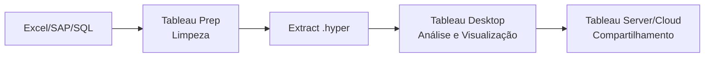

# Introdução ao Tableau para Controladoria

## O que é o Tableau?

Tableau é uma plataforma de análise e visualização de dados líder de mercado, pertencente à Salesforce. Diferente de ferramentas tradicionais de BI, o Tableau foi projetado com uma filosofia *drag-and-drop* que permite explorar dados visualmente sem a necessidade de programação extensiva — embora ofereça recursos avançados como cálculos, LOD e integração com Python/R.

Para o profissional de controladoria, o Tableau preenche uma lacuna crítica: planilhas são estáticas, SQL consulta dados mas não os explora visualmente, e ferramentas como Power BI exigem um ecossistema Microsoft completo. O Tableau oferece agilidade na descoberta de insights financeiros.

## Por que Tableau para Finanças?

| Funcionalidade | Benefício para Controladoria |
|----------------|------------------------------|
| Conectividade | Conecta-se a bancos SQL, BigQuery, Excel, arquivos CSV |
| Cálculos rápidos | YoY, % total, running total sem escrever SQL |
| LOD Expressions | Análises em múltiplos níveis de granularidade (ex: % por centro de custo mantendo total global) |
| Dashboards interativos | Relatórios executivos com filtros cross-source |
| Tableau Public | Grátis para compartilhar relatórios públicos |
| Parâmetros | What-if scenarios sem recarregar dados |

## Tableau Public vs Desktop vs Server

| Produto | Uso | Custo |
|---------|-----|-------|
| **Tableau Public** | Aprendizado, portfólio, dados públicos | Gratuito (dados ficam públicos) |
| **Tableau Desktop** | Profissional individual, dados corporativos | Pago (license) |
| **Tableau Server / Cloud** | Compartilhamento corporativo, governança | Pago (subscription) |
| **Tableau Prep** | ETL e preparação de dados | Pago |

**Recomendação para o curso:** Utilize o **Tableau Public** para praticar. Todos os exemplos do módulo funcionam na versão gratuita.

## Conectando a Fontes de Dados

O Tableau oferece dois modos de conexão:

- **Live (ao vivo):** consulta o banco a cada interação. Ideal para dados em tempo real.
- **Extract (.hyper):** extrai os dados para o motor columnar do Tableau. Ideal para performance em dashboards.

### Conexão com o Banco Grupo Nova Era (SQL)

```
Conexão → PostgreSQL / BigQuery → Servidor: nova-era-db.prod → 
Database: grupo_nova_era → Schema: financeiro → 
Tabelas: dre, balancete, centro_custo, clientes, contas_pagar
```

```sql
-- Query SQL usada como base no Tableau
SELECT 
    ano, mes, conta_contabil, valor,
    centro_custo, departamento, categoria
FROM financeiro.dre
WHERE ano >= 2024
```

## Visão Geral da Interface

```mermaid
block-beta
  columns 3
  block:Header
    columns 1
    Dados Planilha1 Painel História
  end
  space
  block:Left
    columns 1
    block:Conn
      columns 1
      Conexões
      Tabelas
      dre
      balancete
      centro_custo
      Dimensões
      ano[D] mes[D] conta[D]
      Medidas
      valor[M] qtd[M]
    end
  end
  block:Center
    columns 1
    Abas
    Marcas: Cor Tam Rótulo
    COLUNAS
    LINHAS
    block:Viz
      columns 1
      Viz
    end
  end
  block:Footer
    columns 1
    Mostrador de Dados / Aba Dados
  end
end
```

No Tableau, a construção de uma visualização segue uma lógica simples:
1. Arraste **dimensões** para **Colunas** e **Linhas**
2. Arraste **medidas** para o centro da visualização
3. Use **Marcas** para refinar cor, tamanho, rótulo e detalhes
4. Use **Filtros** para limitar o escopo dos dados

## Fluxo de Trabalho na Controladoria



Este módulo vai guiá-lo desde os fundamentos até dashboards executivos completos, sempre usando a base **Grupo Nova Era** como estudo de caso.

---

**Próximo: [Fundamentos do Tableau](01-fundamentos.md)**
