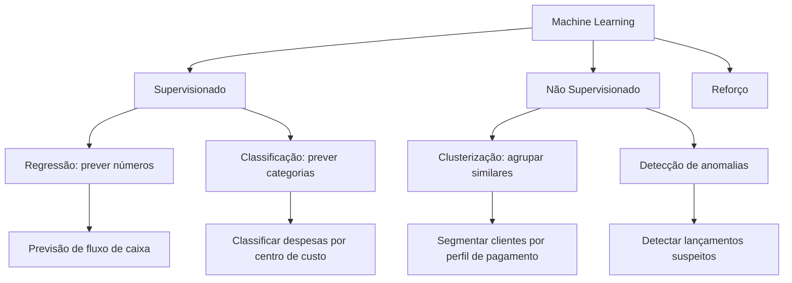
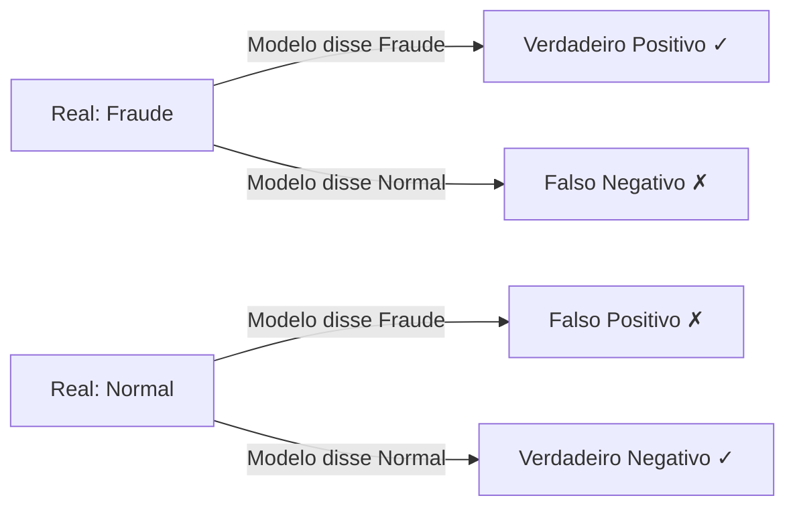

# 5.1 — Fundamentos de Machine Learning para Finanças

> 👶 **Analogia**: Lembra quando você aprendeu a diferença entre "deve" e "haver" na contabilidade? Alguém te mostrou exemplos, você errou algumas vezes, e com a prática passou a acertar sempre. **Machine Learning é exatamente isso** — o computador aprende com exemplos, erra, ajusta, e melhora. A diferença é que ele processa milhões de exemplos por minuto.

:::note Mas então, não é "inteligência de verdade"?
Não. E essa é a boa notícia. ML não pensa, não tem intuição, não "entende" nada. Ele apenas **encontra padrões matemáticos** nos dados. Pense como uma calculadora muito sofisticada: impressionante, mas não mágica. E você não precisa temer uma calculadora, certo?
:::

## O que é Machine Learning?

ML é um conjunto de técnicas onde o computador **aprende padrões** a partir de dados históricos, em vez de seguir regras pré-programadas.

### Exemplo prático

**Abordagem tradicional (regras manuais):**
```
SE valor > 100.000 E conta = "Despesas" ENTAO "revisar"
```

**Abordagem ML (aprendizado por exemplos):**
> "Transações com essas características têm 85% de chance de serem anormais"

Percebe a diferença? No primeiro caso, alguém precisa **pensar em todas as regras possíveis**. No segundo, o modelo **descobre os padrões sozinho** — inclusive aqueles que você nem imaginava que existiam.

## Tipos de Aprendizado



## 🎯 Por que isso importa para você?

Na controladoria, você toma decisões baseadas em **padrões** o tempo todo:
- "Essa despesa está fora do padrão para esta conta"
- "Este cliente costuma pagar com atraso"
- "Neste mês do ano, o fluxo de caixa sempre aperta"

ML faz exatamente isso — mas de forma **sistemática, escalável e mensurável**. Você deixa de depender de "achismo" e passa a ter **probabilidades** baseadas em dados reais. Isso é especialmente útil em auditoria, compliance e previsões.

## Conceitos Essenciais

| Conceito | Analogia | Exemplo Financeiro |
|----------|----------|-------------------|
| **Features** | Características dos dados | Valor, conta, centro de custo, mês |
| **Label/Rótulo** | O que queremos prever | Categoria da despesa, classe de risco |
| **Treino** | Dados usados para aprender | Lançamentos de 2024-2025 |
| **Teste** | Dados para avaliar o modelo | Lançamentos de 2026 |
| **Overfitting** | Decorar em vez de aprender | Modelo bom no passado, ruim no futuro |

:::tip Calma, essa parte parece complicada mas é intuitiva
Métrica é só uma forma de responder "o modelo está acertando?".
Pense como um boletim escolar: notas boas = modelo bom, notas ruins = modelo precisa estudar mais.
:::

## Métricas de Avaliação

### Regressão (prever números)

- **MAE** (Erro Absoluto Médio): "Em média, erramos R$ 5.000 para cima ou para baixo"
- **RMSE**: Penaliza erros grandes (mais sensível a outliers)
- **R²**: "O modelo explica 85% da variação dos dados"

### Classificação (prever categorias)

- **Acurácia**: % de acertos totais
- **Precisão**: "Das transações que marquei como fraude, quantas realmente eram?"
- **Recall**: "Das fraudes reais, quantas eu consegui identificar?"



## Viés vs Variância — ou "O Dilema do Aluno"

> 🧑‍🏫 **Analogia**: Imagine dois alunos estudando para uma prova:
> - **Aluno 1 (Alto viés)**: Estudou só o título dos capítulos. Acha que tudo é simples. Na prova, erra tudo que foge do básico. *(Modelo muito simples)*
> - **Aluno 2 (Alta variância)**: Decorou o livro inteiro, incluindo a página de agradecimentos. Na prova, se a pergunta for diferente do livro, ele trava. *(Modelo muito complexo — overfitting)*
> - **Aluno ideal**: Entendeu os conceitos, sabe aplicar em situações novas. *(Equilíbrio)*

### O que isso significa na prática?

- **Alto viés** (underfitting): modelo muito simples, não aprende os padrões — erra até nos dados de treino
- **Alta variância** (overfitting): modelo muito complexo, decora os dados — vai superbem no treino, mas erra tudo nos dados novos

:::warning 🚩 Overfitting é o inimigo número 1 na controladoria
Um modelo com overfitting parece ótimo nos testes (acerta 99%!), mas quando você coloca ele para funcionar com dados reais do mês seguinte... desastre. É como um contador que só sabe classificar despesas que ele já viu antes.
:::

Para finanças, prefira modelos mais simples e explicáveis (regressão linear, árvores) a modelos complexos (redes neurais) — especialmente para auditoria e compliance.

### Regra de ouro: "Se você não consegue explicar para o auditor, não use"

Modelos simples têm uma vantagem enorme: **transparência**. Você consegue explicar *por que* o modelo chegou a um resultado. Já modelos complexos (redes neurais) são "caixas pretas" — difíceis de auditar.

## O Pipeline de ML na Controladoria

1. **Coleta**: Extrair dados do ERP/banco SQL
2. **Limpeza**: Tratar nulos, outliers, duplicatas
3. **Features**: Criar variáveis úteis (mês, dia da semana, valor médio por conta)
4. **Treino**: Alimentar o modelo com dados históricos
5. **Avaliação**: Testar em dados que o modelo nunca viu
6. **Deploy**: Usar o modelo para prever/classificar novos dados
7. **Monitorar**: Acompanhar se o modelo continua performando bem

## Quando usar ML vs Regras Manuais?

| Situação | Abordagem |
|----------|-----------|
| Classificar 10 despesas por mês | Regras manuais |
| Classificar 10.000 despesas/mês | ML |
| Fraude segue padrão conhecido | Regras (IFTT) |
| Fraude se adapta e muda sempre | ML (detecta padrões novos) |
| Precisão de 100% exigida | Regras (ML nunca é 100%) |
| Tolerância a erros aceitável | ML (muito mais rápido) |

## 🎯 Resumo do Capítulo

| Conceito | Em português claro |
|----------|-------------------|
| **Machine Learning** | Computador aprende padrões com exemplos, não com regras manuais |
| **Supervisionado** | Você mostra o gabarito (label) para o modelo aprender |
| **Não supervisionado** | O modelo descobre padrões sozinho, sem gabarito |
| **Overfitting** | Modelo decora em vez de aprender — ótimo no treino, péssimo na vida real |
| **Viés vs Variância** | Muito simples erra tudo / Muito complexo só sabe o que decorou |
| **Regressão** | Prever números (ex: qual será o faturamento?) |
| **Classificação** | Prever categorias (ex: este cliente vai pagar ou não?) |

> 💡 **Lembrete**: Você não precisa decorar fórmulas. O importante é entender os conceitos para saber **quando e como aplicar** ML na controladoria. O computador faz as contas; você faz as perguntas certas.

## Exercício de Fixação (sem pressão)

Pegue um café. Pense em 3 problemas da sua área que poderiam ser resolvidos com ML. Não tem resposta errada — o objetivo é começar a pensar "como um cientista de dados" sem a parte complicada:

1. **Que tipo de dado** você tem disponível?
2. **Qual seria o label** (o que prever)?
3. **Quais seriam as features** (características dos dados)?
4. **É um problema de regressão ou classificação**?

:::tip Exemplo para você começar
"Quero prever quais fornecedores vão atrasar entregas este mês." → Dados: histórico de atrasos, valor do contrato, tempo de relacionamento → Label: "Atrasa/Não atrasa" → Classificação.
:::
