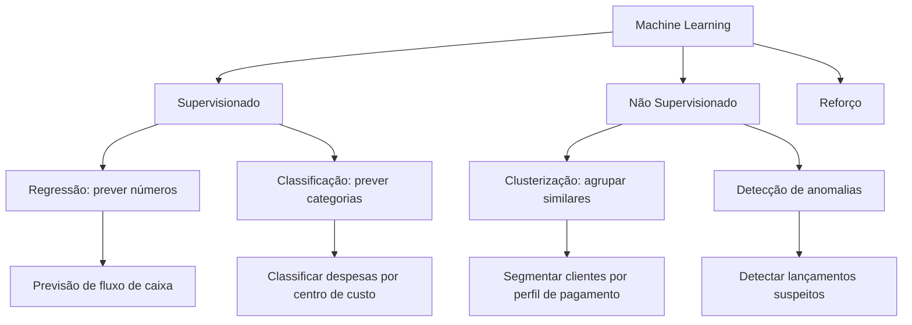
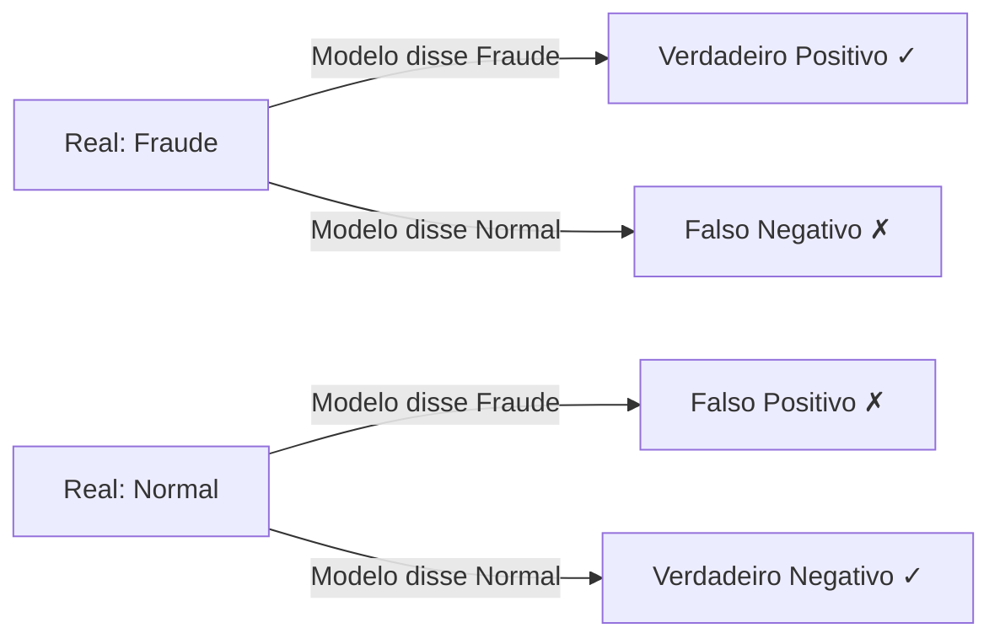

# 5.1 — Fundamentos de Machine Learning para Finanças

## O que é Machine Learning?

ML é um conjunto de técnicas onde o computador **aprende padrões** a partir de dados históricos, em vez de seguir regras pré-programadas.

### Exemplo prático

Em vez de escrever regras manuais:
```
SE valor > 100.000 E conta = "Despesas" ENTAO "revisar"
```

O ML aprende sozinho:
> "Transações com essas características têm 85% de chance de serem anormais"

## Tipos de Aprendizado



## Conceitos Essenciais

| Conceito | Analogia | Exemplo Financeiro |
|----------|----------|-------------------|
| **Features** | Características dos dados | Valor, conta, centro de custo, mês |
| **Label/Rótulo** | O que queremos prever | Categoria da despesa, classe de risco |
| **Treino** | Dados usados para aprender | Lançamentos de 2024-2025 |
| **Teste** | Dados para avaliar o modelo | Lançamentos de 2026 |
| **Overfitting** | Decorar em vez de aprender | Modelo bom no passado, ruim no futuro |

## Métricas de Avaliação

### Regressão (prever números)

- **MAE** (Erro Absoluto Médio): "Em média, erramos R$ 5.000 para cima ou para baixo"
- **RMSE**: Penaliza erros grandes (mais sensível a outliers)
- **R²**: "O modelo explica 85% da variação dos dados"

### Classificação (prever categorias)

- **Acurácia**: % de acertos totais
- **Precisão**: "Das transações que marquei como fraude, quantas realmente eram?"
- **Recall**: "Das fraudes reais, quantas eu consegui identificar?"



## Viés vs Variância

- **Alto viés** (underfitting): modelo muito simples, não aprende os padrões
- **Alta variância** (overfitting): modelo muito complexo, decora os dados

Para finanças, prefira modelos mais simples e explicáveis (regressão linear, árvores) a modelos complexos (redes neurais) — especialmente para auditoria e compliance.

## O Pipeline de ML na Controladoria

1. **Coleta**: Extrair dados do ERP/banco SQL
2. **Limpeza**: Tratar nulos, outliers, duplicatas
3. **Features**: Criar variáveis úteis (mês, dia da semana, valor médio por conta)
4. **Treino**: Alimentar o modelo com dados históricos
5. **Avaliação**: Testar em dados que o modelo nunca viu
6. **Deploy**: Usar o modelo para prever/classificar novos dados
7. **Monitorar**: Acompanhar se o modelo continua performando bem

## Quando usar ML vs Regras Manuais?

| Situação | Abordagem |
|----------|-----------|
| Classificar 10 despesas por mês | Regras manuais |
| Classificar 10.000 despesas/mês | ML |
| Fraude segue padrão conhecido | Regras (IFTT) |
| Fraude se adapta e muda sempre | ML (detecta padrões novos) |
| Precisão de 100% exigida | Regras (ML nunca é 100%) |
| Tolerância a erros aceitável | ML (muito mais rápido) |

## Exercício de Fixação

Pense em 3 problemas da sua área que poderiam ser resolvidos com ML:

1. Que tipo de dado você tem disponível?
2. Qual seria o label (o que prever)?
3. Quais seriam as features?
4. É um problema de regressão ou classificação?
