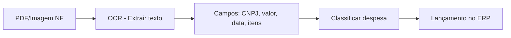

# 5.4 — Classificação Inteligente de Despesas

> 📋 **Analogia**: Imagine que você precisa organizar 5.000 recibos em 40 pastas diferentes. Você olha cada recibo e decide: "energia → conta 50, aluguel → conta 50, material escritório → conta 51..." Agora imagine ensinar um estagiário a fazer isso. Você mostra alguns exemplos, ele observa os padrões, e depois de 500 recibos ele já acerta 90% sozinho. **É exatamente isso que a classificação com IA faz.**

:::note O problema que você conhece bem
Se você trabalha com contabilidade, sabe: classificar despesas manualmente é:
1. **Chato** (repetitivo)
2. **Inconsistente** (o João classifica "Material de Escritório" de um jeito, a Maria de outro)
3. **Propenso a erros** (depois de 200 lançamentos, seu cérebro desliga)

O ML não substitui seu julgamento — ele faz o **trabalho braçal** de classificar, e você revisa os casos duvidosos.
:::

## 🎯 Por que isso importa para você?

Na controladoria, classificação incorreta de despesas significa:
- **Distorção de resultados** por centro de custo
- **Retrabalho** em fechamentos mensais
- **Risco fiscal** se a conta contábil estiver errada
- **Horas perdidas** que poderiam ser dedicadas a análise, não a digitação

Com classificação inteligente, você:
- Reduz de 2-5 min por documento para **segundos**
- Mantém **consistência** — o modelo classifica igual todo dia
- Libera sua equipe para **análise**, não para digitação

## O Problema

Empresas processam milhares de notas fiscais e despesas por mês. Classificar manualmente cada lançamento no centro de custo e conta contábil correto é:

- **Lento**: 2-5 minutos por documento
- **Inconsistente**: Cada pessoa classifica de um jeito
- **Caro**: Horas de pessoal especializado

## Abordagens de Classificação

### 1. Regras Manuais (IF/THEN)

```sql
-- Regras de classificação tradicionais
SELECT
    historico,
    CASE
        WHEN historico LIKE '%ENERGIA%' OR historico LIKE '%ELETRICIDADE%' THEN 50
        WHEN historico LIKE '%ALUGUEL%' THEN 50
        WHEN historico LIKE '%TELEFONE%' OR historico LIKE '%INTERNET%' THEN 52
        WHEN historico LIKE '%COMISSÃO%' OR historico LIKE '%COMISSAO%' THEN 45
        WHEN historico LIKE '%FRETE%' THEN 47
        WHEN historico LIKE '%MATERIAL ESCRIT%' THEN 51
        ELSE NULL
    END AS conta_sugerida
FROM lancamentos_contabeis;
```

**Problema**: Não escala — centenas de regras, manutenção complexa.

### 2. ML — Classificação de Texto

O modelo aprende a partir de exemplos históricos qual conta contábil corresponde a cada descrição.

### Features para Classificação

| Feature | Como extrair |
|---------|-------------|
| **Texto da descrição** | Bruto, limpo (stop words removidas) |
| **Fornecedor** | Quem emitiu |
| **Valor** | Faixa de valor (pequeno, médio, grande) |
| **Centro de custo histórico** | Onde foi alocado antes |
| **Departamento** | Quem solicitou |
| **Tipo de documento** | NF, recibo, contrato |

## Exemplo: Classificação com Similaridade

Usando SQL para encontrar lançamentos similares:

```sql
-- Encontrar despesas similares já classificadas
SELECT
    l.historico,
    l2.historico AS similar_a,
    p2.descricao AS conta_sugerida,
    cc2.descricao AS centro_custo_sugerido,
    COUNT(*) AS ocorrencias
FROM lancamentos_contabeis l
CROSS JOIN lancamentos_contabeis l2
    ON l.id_lancamento <> l2.id_lancamento
    AND l2.debito_credito = 'debito'
INNER JOIN planos_contas p2 ON l2.id_conta = p2.id_conta
INNER JOIN centros_custo cc2 ON l2.id_centro_custo = cc2.id_centro_custo
WHERE l.historico LIKE '%' || SUBSTR(l2.historico, 1, 10) || '%'
  AND l.id_conta IS NOT NULL
GROUP BY l.historico, l2.historico, p2.descricao, cc2.descricao
ORDER BY ocorrencias DESC;
```

:::tip "NLP" = Natural Language Processing = "Computador entendendo texto"
NLP é a área da IA que permite ao computador **ler e interpretar texto**. É assim que o modelo sabe que "ALUGUEL MATRIZ JANEIRO 2026" tem a ver com a conta de Aluguel (50) e não com Material de Escritório (51). Você não precisa entender os detalhes técnicos — mas é bom saber que não é mágica, é só matemática aplicada em palavras.
:::

## NLP (Processamento de Linguagem Natural)

### Como funciona na prática

1. **Tokenização**: Quebrar "ALUGUEL MATRIZ JANEIRO 2026" em palavras individuais
2. **Remoção de stop words**: Tirar palavras irrelevantes (artigos, preposições — "o", "a", "de", "para")
3. **Stemming**: Reduzir palavras à raiz (ALUGUEL → ALUG, CORRENDO → CORR)
4. **TF-IDF**: Dar peso para as palavras mais importantes (se "ENERGIA" aparece muito em despesas de luz e nunca em aluguel, o modelo aprende isso)
5. **Classificador**: Modelo que associa palavras a contas contábeis

> 💡 **Resumo para não-técnicos**: O computador quebra o texto em pedaços, tira o que não importa, e descobre quais palavras são "marcadoras" de cada tipo de despesa. É como você sabe que "NF" e "fatura" indicam nota fiscal, enquanto "holerite" indica folha de pagamento.

## LLMs (Large Language Models) para Classificação

Modelos como GPT, Claude e Gemini podem classificar despesas com alta acurácia.

### Exemplo de Prompt

```
Classifique a seguinte despesa em uma conta contábil e centro de custo:

Histórico: "NF 1234 - COMPRA DE CARTOLINAS E CANETAS"
Fornecedor: "Papelaria Central Ltda"
Valor: R$ 487,50

Contas disponíveis:
- 5.1.1.01: Comissões
- 5.1.1.03: Frete
- 5.1.2.01: Salários
- 5.1.2.03: Material de Escritório
- 5.1.2.04: Serviços de Terceiros
- 5.1.5: Outras Receitas

Centros de Custo: ADM, FIN, COM, PROD, LOG, TI, RH, JUR

Responda no formato JSON:
{
  "conta": "codigo",
  "centro_custo": "codigo",
  "justificativa": "explicação curta"
}
```

### Vantagens dos LLMs

- Entendem contexto e sinônimos
- Funcionam com descrições curtas ou ambíguas
- Se adaptam rápido a novas regras
- Podem justificar a classificação (auditável)

## Extração de Dados de Documentos Fiscais

### Google Document AI + OCR



### Campos Extraídos Automaticamente

| Campo | Onde está na NF |
|-------|----------------|
| CNPJ do emissor | Cabeçalho |
| Número NF | Topo |
| Data de emissão | Cabeçalho |
| Valor total | Final do documento |
| Base de ICMS | Área de tributos |
| Descrição dos itens | Corpo |
| CFOP | Cabeçalho |

## Pipeline Automatizado de Classificação

```sql
-- Simulação: classificação baseada em regras + ML
WITH despesas_nao_classificadas AS (
    SELECT * FROM lancamentos_contabeis
    WHERE id_conta IS NULL
),
classificacao_ml AS (
    SELECT
        id_lancamento,
        CASE
            WHEN historico LIKE '%ENERGIA%' THEN 50  -- Aluguel (por simplicidade)
            WHEN historico LIKE '%ALUGUEL%' THEN 50
            WHEN historico LIKE '%COMISS%' THEN 45
            WHEN historico LIKE '%FRETE%' THEN 47
            WHEN historico LIKE '%MATERIAL%' AND (historico LIKE '%ESCRIT%' OR historico LIKE '%PAPEL%') THEN 51
            WHEN valor < 500 THEN 51  -- Material escritório (valor baixo)
            ELSE 52  -- Serviços terceiros (genérico)
        END AS conta_sugerida,
        CASE
            WHEN historico LIKE '%PRODU%' THEN 4
            WHEN historico LIKE '%VEND%' THEN 3
            WHEN historico LIKE '%LOG%' OR historico LIKE '%FRETE%' THEN 5
            WHEN historico LIKE '%TI%' OR historico LIKE '%SOFTWARE%' OR historico LIKE '%SISTEMA%' THEN 6
            ELSE 1  -- ADM (genérico)
        END AS centro_custo_sugerido
    FROM despesas_nao_classificadas
)
SELECT * FROM classificacao_ml;
```

## Ferramentas Práticas

| Ferramenta | Função | Ideal para |
|------------|--------|------------|
| **Bilíngua.ai** | Classificação fiscal automática | Empresas brasileiras |
| **DocAI (Google)** | Extração de documentos fiscais | Grandes volumes |
| **Rossum** | Captura de dados de NF | Processamento AP |
| **Hypatos** | Classificação + extração | Workflow completo |
| **GPT/Claude** | Classificação via prompt | Startups e médias empresas |

## 🎯 Resumo do Capítulo

| Conceito | Em português claro |
|----------|-------------------|
| **Classificação** | Modelo aprende a associar descrições a contas contábeis corretas |
| **NLP** | Computador "lê" o texto da despesa e extrai palavras-chave |
| **LLM (GPT/Claude)** | Modelo que entende contexto e sinônimos — classifica até descrições ambíguas |
| **OCR** | Tecnologia que "lê" texto de imagens e PDFs de notas fiscais |
| **Pipeline** | Fluxo automatizado: NF chega → sistema extrai → classifica → lança no ERP |

> 💡 A classificação inteligente não elimina o contador — **elimina o trabalho braçal**. Você vira de "quem digita" para "quem revisa e aprova". Muito mais estratégico, muito menos entediante.

## Exercício

1. Crie regras de classificação para 5 tipos de despesa no banco Nova Era
2. Escreva um prompt para classificar "CONSULTORIA FINANCEIRA MENSAL - R$ 8.500" e "NF 4455 - PEÇAS PARA MANUTENÇÃO PREVENTIVA"
3. Crie uma query que sugira a conta contábil para lançamentos não classificados baseada em similaridade com lançamentos já classificados

:::warning Cuidado com o viés do modelo
Se seus dados históricos de classificação tiverem erros, o modelo vai **aprender os erros**. É o velho ditado: "lixo entra, lixo sai". Sempre vale a pena auditar uma amostra dos dados de treino antes de treinar o modelo.
:::
