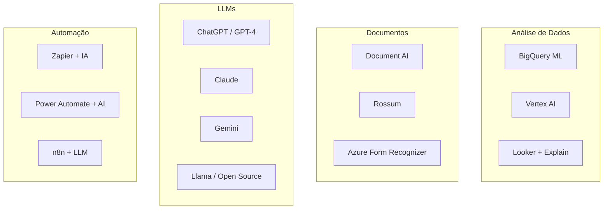

# 5.6 — Ferramentas Práticas de IA para Controladoria

> 🧰 **Analogia**: Você não precisa saber construir um martelo para usar um. IA aplicada é a mesma coisa. Existem dezenas de ferramentas prontas que fazem o trabalho pesado para você — seu papel é **escolher a ferramenta certa para cada problema**, não construí-las do zero.

:::note Você não vai programar nada aqui
Este capítulo é um **tour guiado** pelas ferramentas de IA disponíveis no mercado.
Pense como um catálogo: você vai conhecer o que existe, para que serve cada uma, e quando usar.
Nada de código novo — só exemplos para você ver como funciona.
:::

## 🎯 Por que isso importa para você?

O mercado de ferramentas de IA cresce tão rápido que é fácil se sentir perdido. Este capítulo é seu **mapa**:
- O que cada ferramenta faz (sem jargão técnico)
- Quando usar cada uma (baseado no seu problema real)
- Quanto custa (aproximadamente)
- Qual a complexidade (para você planejar a implementação)

## Panorama das Ferramentas



## 1. LLMs (Large Language Models)

### Chat GPT / GPT-4

**Para análise financeira:**

```
Prompt: "Analise a DRE abaixo e destaque os 3 principais riscos financeiros:

RECEITA LÍQUIDA: R$ 1.200.000
CPV: R$ 720.000 (60%)
LUCRO BRUTO: R$ 480.000 (40%)
DESPESAS ADM: R$ 250.000
DESPESAS COMERCIAIS: R$ 120.000
RESULTADO: R$ 110.000

Forneça uma análise de 5 linhas em português."
```

**Para escrever SQL:**

```
Prompt: "Escreva uma query SQL no BigQuery que calcule o 
prazo médio de recebimento (PMR) por cliente nos últimos 
6 meses, considerando data de emissão da nota e data de 
recebimento. Use a sintaxe do BigQuery."
```

### Claude (Anthropic)

Excelente para análise de contratos e documentos longos.

### Gemini (Google)

Integração nativa com Google Sheets, Gmail, Drive.

## 2. Google Cloud AI para Finanças

### Document AI

Processamento de documentos fiscais:

| Tipo de Documento | Extrator | Precisão |
|-------------------|----------|----------|
| NF-e | `expense-parser` | 95%+ |
| CT-e | `freight-invoice-parser` | 90%+ |
| Recibos | `receipt-parser` | 85%+ |
| Contratos | `contract-parser` | 80%+ |

```python
# Exemplo conceitual de uso da API
from google.cloud import documentai

client = documentai.DocumentProcessorServiceClient()
result = client.process_document(request={
    'name': 'projects/.../locations/us/processors/expense-parser',
    'raw_document': {'content': pdf_file, 'mime_type': 'application/pdf'}
})

# Campos extraídos automaticamente
print(result.document.entities)  # CNPJ, valor, data, itens
```

### Vertex AI

Plataforma completa para ML. Permite:

- **AutoML**: Treinar modelos sem código
- **Model Garden**: Modelos pré-treinados para finanças
- **Prediction**: Servir modelos em produção
- **Explainable AI**: Explicar por que o modelo tomou cada decisão

## 3. Ferramentas de BI com IA

### Looker + Explain

Looker tem recursos de IA que explicam visualizações:

- **Explain**: "Por que essa métrica caiu 15%?"
- **Anomaly Detection**: Alertas automáticos de desvios
- **Natural Language**: "Qual cliente mais cresceu esse mês?"

### Tableau + Einstein

- **Explain Data**: Explicações automáticas de outliers
- **Forecasting**: Previsões com um clique
- **Ask Data**: Consultas em linguagem natural

## 4. Automação com IA

### Fluxo de trabalho com n8n


### Zapier + IA

Conecta ferramentas sem código:

- **Trigger**: Novo e-mail com fatura
- **Action**: Extrair dados com GPT
- **Result**: Atualizar planilha no Google Sheets
- **Notify**: Enviar alerta no Slack

## 5. GitHub Copilot para SQL

Se você usa VS Code, o Copilot acelera a escrita de SQL:

```sql
-- Digite o comentário e ele sugere a query
-- Total de vendas por mês com crescimento percentual
```

O Copilot sugere automaticamente:
```sql
SELECT
    STRFTIME('%Y-%m', data_emissao) AS mes,
    SUM(valor_liquido) AS total_vendas,
    LAG(SUM(valor_liquido)) OVER (ORDER BY mes) AS mes_anterior,
    (SUM(valor_liquido) - LAG(SUM(valor_liquido)) OVER (ORDER BY mes)) 
    / LAG(SUM(valor_liquido)) OVER (ORDER BY mes) * 100 AS crescimento
FROM faturamento
GROUP BY mes
ORDER BY mes;
```

## 6. Google Sheets + IA

Recursos nativos do Sheets para finanças:

- **=GPT()**: Função não oficial via Apps Script
- **Explore**: "Qual a média de vendas por cliente?"
- **Sheets + BigQuery**: Conecte dados direto do BQ

## Matriz de Decisão

| Problema | Ferramenta | Complexidade | Custo |
|----------|-----------|-------------|-------|
| Classificar 100 despesas/dia | GPT prompt | Baixa | Baixo |
| Classificar 10.000 despesas/dia | Document AI | Média | Médio |
| Prever fluxo de caixa | BigQuery ML | Baixa | Baixo |
| Detectar fraudes em tempo real | Vertex AI | Alta | Alto |
| Automatizar AP completo | Rossum + n8n | Média | Médio |
| Dashboard executivo | Looker + Explain | Baixa | Médio |
| Análise de contratos | Claude | Baixa | Baixo |

## 🎯 Resumo do Capítulo

| Ferramenta | Para que serve | Quando usar |
|-----------|----------------|-------------|
| **LLMs (GPT, Claude, Gemini)** | Análise de texto, prompts, classificação | Problemas que exigem "entendimento" de linguagem |
| **Document AI** | Extrair dados de notas fiscais e contratos | Grandes volumes de documentos |
| **Vertex AI** | Plataforma completa de ML | Quando BQML não é suficiente |
| **Looker / Tableau** | BI com IA explicativa | Dashboards executivos |
| **n8n / Zapier** | Automatizar fluxos com IA | Processos repetitivos com várias etapas |
| **Copilot** | Acelerar escrita de SQL | Seu dia a dia no VS Code |

> 💡 **Regra prática**: Comece simples (GPT para classificação, BQML para previsão). Só migre para ferramentas mais complexas quando a simples não der conta. 80% dos problemas de controladoria se resolvem com **LLM + BQML + SQL**.

## Exercício Final

1. Desenhe um pipeline automatizado para processar notas fiscais de fornecedores desde o recebimento até o lançamento contábil, usando pelo menos 2 ferramentas de IA
2. Escreva um prompt para o ChatGPT que analise o Aging Report (contas a receber) e sugira ações de cobrança prioritárias
3. Compare: para classificar 50.000 despesas/mês, qual combinação de ferramentas você recomenda? Considere custo, precisão e complexidade

import Quiz from '@site/src/components/Quiz'
import quizes from '@site/src/components/Quiz/quizData'

<Quiz moduleId="modulo5" title={quizes.modulo5.title} questions={quizes.modulo5.questions} />
