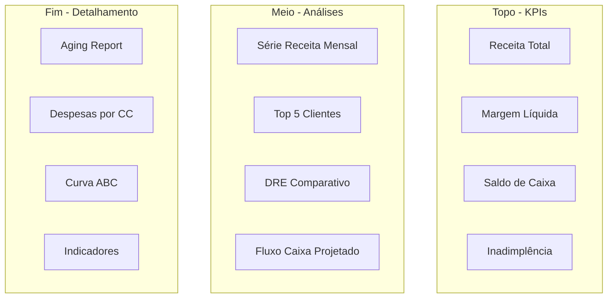

# 6.5 — Dashboard Executivo

> 🚗 **Analogia do Dia**  
> Você entra no carro e olha o painel: velocímetro, combustível, temperatura, rotação. Em 2 segundos, você sabe se está tudo bem ou se precisa agir.
>
> **Um dashboard executivo é exatamente isso** — só que em vez de velocímetro, você tem receita; em vez de combustível, margem líquida; em vez de temperatura, inadimplência.
>
> A diretoria não quer abrir planilhas. Quer **olhar o painel e decidir**.

---

## Objetivo

Projetar um dashboard executivo que consolide todos os insights financeiros em uma única visualização. **É a entrega mais importante do projeto** — é o que a diretoria vai ver.

:::note Por que isso importa para você?

Na sua rotina, você prepara relatórios que muitas vezes ninguém lê por completo. O dashboard resolve isso:

- **Tudo em um lugar** — sem abrir 5 planilhas diferentes
- **Sempre atualizado** — conectado ao banco de dados
- **Auto-explicativo** — cores, gráficos, resumos
- **Foco no que importa** — KPIs, tendências, alertas

Seu papel de controller evolui de "preparar relatório" para "interpretar o painel e recomendar ações".
:::

---

## Estrutura do Dashboard — "O Painel do Avião"

O dashboard tem 3 camadas, como um painel de avião:



> 💡 **Topo → Meio → Fim:** Funciona como um funil. O executivo olha os KPIs (topo). Se algo chama atenção, desce para as análises (meio). Se precisar de detalhe, vai ao fim.

---

## Camada de Dados: Query Única do Dashboard

**O que faz:** Uma única consulta que alimenta todo o dashboard. **Não precisa de 10 queries separadas.**

```sql
-- Query consolidada para o dashboard
WITH
kpis AS (
    SELECT
        (SELECT SUM(valor_liquido) FROM faturamento) AS receita_total,
        (SELECT SUM(valor_liquido) FROM faturamento) -
        (SELECT SUM(valor) FROM dre_mensal WHERE id_conta IN (39,40,41)) AS lucro_bruto,
        (SELECT SUM(valor) FROM contas_receber WHERE status = 'aberto') -
        (SELECT SUM(valor) FROM contas_pagar WHERE status = 'aberto') AS saldo_caixa_projetado,
        ROUND((SELECT SUM(valor) FROM contas_receber WHERE status = 'aberto' AND data_vencimento < '2026-06-30') * 100.0 /
              NULLIF((SELECT SUM(valor) FROM contas_receber WHERE status = 'aberto'), 0), 2) AS inadimplencia_pct
),
receita_mensal AS (
    SELECT
        strftime('%Y-%m', data_emissao) AS mes,
        SUM(valor_liquido) AS receita
    FROM faturamento
    GROUP BY mes
),
top_clientes AS (
    SELECT
        c.nome,
        SUM(f.valor_liquido) AS total
    FROM faturamento f
    INNER JOIN clientes c ON f.id_cliente = c.id_cliente
    GROUP BY c.nome
    ORDER BY total DESC
    LIMIT 5
),
dre_resumo AS (
    SELECT
        'Receita Líquida' AS conta, SUM(valor_liquido) AS valor FROM faturamento
    UNION ALL
    SELECT 'CPV', SUM(valor) FROM dre_mensal WHERE id_conta IN (39,40,41)
    UNION ALL
    SELECT 'Lucro Bruto', (SELECT SUM(valor_liquido) FROM faturamento) - (SELECT SUM(valor) FROM dre_mensal WHERE id_conta IN (39,40,41))
)
SELECT 'KPI' AS secao, 'receita_total' AS item, receita_total AS valor FROM kpis;
```

---

## Indicadores-Chave (KPIs)

**Estes são os 4 KPIs que devem estar no topo do dashboard — os "mostradores principais" do painel:**

| KPI | Fórmula | O que significa |
|-----|---------|-----------------|
| Receita Total | `SUM(valor_liquido)` | Quanto faturou no período |
| Margem Bruta | `(Receita - CPV) / Receita` | % que sobra depois dos custos |
| Margem Líquida | `Resultado / Receita` | % que sobra depois de TUDO |
| Inadimplência | `Vencido > 30d / Total a Receber` | % dos clientes que não pagaram |

| KPI | Query |
|-----|-------|
| Receita Total | `SELECT SUM(valor_liquido) FROM faturamento` |
| Margem Bruta | `SELECT (SUM(vl) - SUM(cpv)) / SUM(vl)` |
| Margem Líquida | `SELECT (rec - cpv - desp) / rec` |
| Prazo Médio Recebimento | `SELECT (saldo_aberto / rec_media) * 30` |
| Inadimplência | `SELECT SUM(vencido) / SUM(total)` |
| Liquidez Corrente | Simulação com saldos |
| Crescimento Mensal | `LAG()` function |

---

## Visualizações Sugeridas

**Cada análise pede um tipo de gráfico. Escolha o certo:**

| Análise | Tipo de Gráfico | Por quê |
|---------|----------------|---------|
| Série Receita Mensal | 📈 Linhas | Mostra tendência ao longo do tempo |
| Top 10 Clientes | 📊 Barras horizontais | Fácil comparar valores |
| DRE do Mês | 🌊 Cascata (waterfall) | Mostra "receita → custos → resultado" |
| Aging Report | 📋 Tabela | Dados tabulares com cores |
| Inadimplência | 🎯 Velocímetro (gauge) | Verde/Amarelo/Vermelho — intuitivo |
| Despesas por CC | 🔥 Mapa de calor | Vê padrões de despesa |

### 1. Série Temporal — Receita Mensal
Gráfico de linhas com receita mês a mês e meta

### 2. Barras — Top 10 Clientes
Barras horizontais com valor e % de participação

### 3. Waterfall — DRE do Mês
Gráfico cascata: Receita → CPV → Lucro Bruto → Despesas → Resultado

### 4. Tabela — Aging Report
Contas a receber por faixa (a vencer, 1-30, 31-60, 61-90, 90+)

### 5. Gauge — Inadimplência
Velocímetro com threshold (verde < 5%, amarelo 5-10%, vermelho > 10%)

### 6. Heatmap — Despesas por Centro de Custo
Intensidade de cor por CC × mês

---

## Filtros do Dashboard — "Os Controles do Painel"

Assim como você ajusta o ar-condicionado ou o som do carro, o dashboard tem filtros:

- **Período**: Mês/Ano (jan-jun 2026) — para comparar meses
- **Empresa**: Grupo Nova Era (matriz)
- **Cliente**: Todos / Top 5 / Selecionar — para focar em um cliente
- **Centro de Custo**: Todos / ADM / COM / PROD — para ver despesas de uma área

---

## Entrega Final

- Projeto conceitual do dashboard (diagrama + descrição)
- Queries SQL para cada KPI e visualização
- Mockup do dashboard com dados reais do Nova Era
- Mini guia de interpretação: "O que olhar primeiro?"

## Resumo do Capítulo

- ✅ **Dashboard** = painel do carro: KPIs no topo, análises no meio, detalhes no fim
- ✅ **4 KPIs principais**: Receita, Margem Bruta, Margem Líquida, Inadimplência
- ✅ **Cada gráfico tem um propósito** — escolha o tipo certo para cada dado
- ✅ **Filtros** permitem ao usuário navegar sem precisar de novas queries
