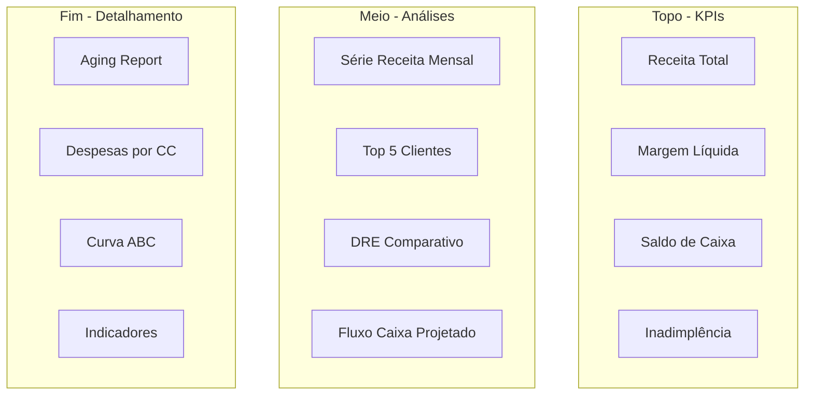

# 6.5 — Dashboard Executivo

## Objetivo

Projetar um dashboard executivo que consolide todos os insights financeiros em uma única visualização.

## Estrutura do Dashboard



## Camada de Dados: Query Única do Dashboard

```sql
-- Query consolidada para o dashboard
WITH
kpis AS (
    SELECT
        (SELECT SUM(valor_liquido) FROM faturamento) AS receita_total,
        (SELECT SUM(valor_liquido) FROM faturamento) -
        (SELECT SUM(valor) FROM dre_mensal WHERE id_conta IN (39,40,41)) AS lucro_bruto,
        (SELECT SUM(valor) FROM contas_receber WHERE status = 'aberto') -
        (SELECT SUM(valor) FROM contas_pagar WHERE status = 'aberto') AS saldo_caixa_projetado,
        ROUND((SELECT SUM(valor) FROM contas_receber WHERE status = 'aberto' AND data_vencimento < '2026-06-30') * 100.0 /
              NULLIF((SELECT SUM(valor) FROM contas_receber WHERE status = 'aberto'), 0), 2) AS inadimplencia_pct
),
receita_mensal AS (
    SELECT
        strftime('%Y-%m', data_emissao) AS mes,
        SUM(valor_liquido) AS receita
    FROM faturamento
    GROUP BY mes
),
top_clientes AS (
    SELECT
        c.nome,
        SUM(f.valor_liquido) AS total
    FROM faturamento f
    INNER JOIN clientes c ON f.id_cliente = c.id_cliente
    GROUP BY c.nome
    ORDER BY total DESC
    LIMIT 5
),
dre_resumo AS (
    SELECT
        'Receita Líquida' AS conta, SUM(valor_liquido) AS valor FROM faturamento
    UNION ALL
    SELECT 'CPV', SUM(valor) FROM dre_mensal WHERE id_conta IN (39,40,41)
    UNION ALL
    SELECT 'Lucro Bruto', (SELECT SUM(valor_liquido) FROM faturamento) - (SELECT SUM(valor) FROM dre_mensal WHERE id_conta IN (39,40,41))
)
SELECT 'KPI' AS secao, 'receita_total' AS item, receita_total AS valor FROM kpis;
```

## Indicadores-Chave (KPIs)

| KPI | Fórmula | Query |
|-----|---------|-------|
| Receita Total | `SUM(valor_liquido)` | `SELECT SUM(valor_liquido) FROM faturamento` |
| Margem Bruta | `(Receita - CPV) / Receita` | `SELECT (SUM(vl) - SUM(cpv)) / SUM(vl)` |
| Margem Líquida | `Resultado / Receita` | `SELECT (rec - cpv - desp) / rec` |
| Prazo Médio Recebimento | `(Contas a Receber / Receita) * 30` | `SELECT (saldo_aberto / rec_media) * 30` |
| Inadimplência | `Vencido > 30d / Total a Receber` | `SELECT SUM(vencido) / SUM(total)` |
| Liquidez Corrente | `Ativo Circ / Passivo Circ` | Simulação com saldos |
| Crescimento Mensal | `(Mês Atual / Mês Anterior - 1) * 100` | LAG() function |

## Visualizações Sugeridas

### 1. Série Temporal — Receita Mensal
Gráfico de linhas com receita mês a mês e meta

### 2. Barras — Top 10 Clientes
Barras horizontais com valor e % de participação

### 3. Waterfall — DRE do Mês
Gráfico cascata: Receita → CPV → Lucro Bruto → Despesas → Resultado

### 4. Tabela — Aging Report
Contas a receber por faixa (a vencer, 1-30, 31-60, 61-90, 90+)

### 5. Gauge — Inadimplência
Velocímetro com threshold (verde < 5%, amarelo 5-10%, vermelho > 10%)

### 6. Heatmap — Despesas por Centro de Custo
Intensidade de cor por CC × mês

## Filtros do Dashboard

- **Período**: Mês/Ano (jan-jun 2026)
- **Empresa**: Grupo Nova Era (matriz)
- **Cliente**: Todos / Top 5 / Selecionar
- **Centro de Custo**: Todos / ADM / COM / PROD

## Entrega Final

- Projeto conceitual do dashboard (diagrama + descrição)
- Queries SQL para cada KPI e visualização
- Mockup do dashboard com dados reais do Nova Era
- Mini guia de interpretação: "O que olhar primeiro?"
