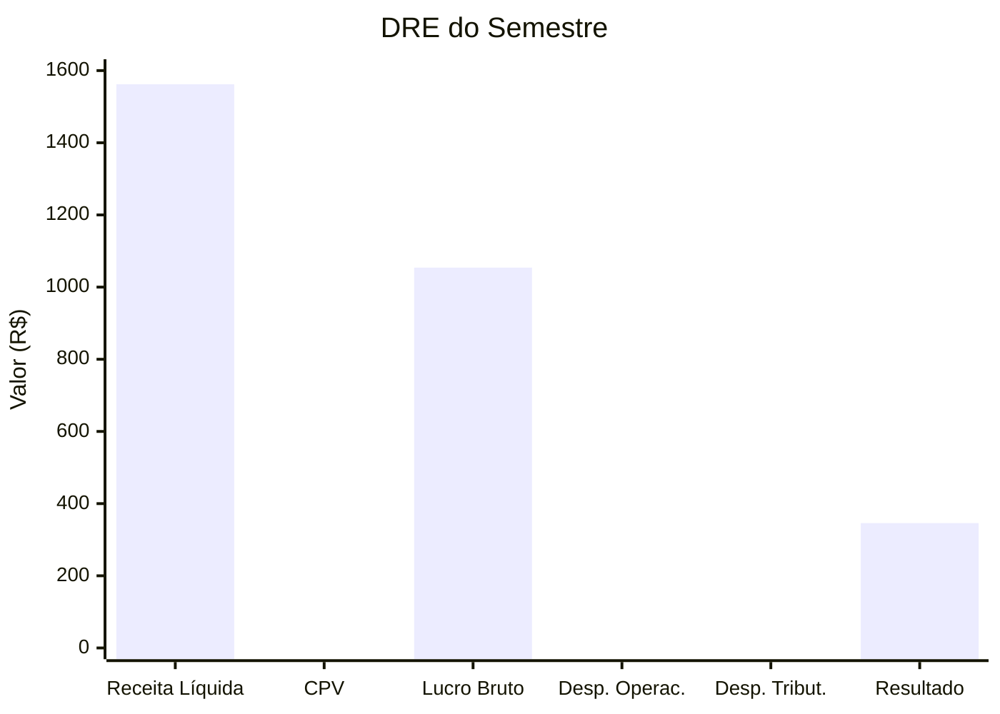

# 6.6 — Apresentação dos Resultados

> 🎤 **Analogia do Dia**  
> Você já passou por isso: reunião de diretoria, todos os olhos em você, e você precisa explicar os números do semestre em 15 minutos.
>
> **Esta etapa é EXATAMENTE isso** — só que agora você tem os números prontos, as queries funcionando, e uma história para contar.
>
> Lembre-se: a diretoria não quer saber de SQL. Quer saber: **"A empresa está saudável? O que precisamos fazer?"**

---

## Objetivo

Consolidar todo o trabalho em uma apresentação executiva simulando uma reunião de diretoria. **É a hora de mostrar o valor do seu trabalho.**

:::note Por que isso importa para você?

De nada adianta fazer queries incríveis, DRE automatizada e dashboard se você não consegue **comunicar os resultados**.

Na controladoria, seu diferencial não é só calcular — é **traduzir números em decisões**. Esta etapa treina exatamente isso:

- Contar uma história com dados
- Separar o essencial do acessório
- Recomendar ações com base em evidências
- Falar a linguagem do negócio (não a linguagem técnica)

É a habilidade que separa um controller de um "preparador de relatórios".
:::

---

## Estrutura da Apresentação — 7 Slides, 15 Minutos

### Slide 1: Capa
**Análise Financeira Grupo Nova Era S.A. — 1º Semestre 2026**

"Bom dia, diretoria. Vou apresentar a análise financeira do primeiro semestre."

---

### Slide 2: Resumo Executivo — "O Raio-X"

**O que a diretoria precisa saber em 30 segundos:**

```
📈 Receita Total: R$ 1.562.200 (+8,3% vs semestre anterior)
💰 Margem Líquida: 12,4%
🏦 Saldo de Caixa Projetado: R$ 157.800
⚠️ Inadimplência: 4,2% (controlado)
✅ Principal Risco: Concentração em 2 clientes (35% da receita)
```

> 💡 **Regra de ouro da apresentação:** comece pelo resumo executivo. Se só tiver 2 minutos, é isso que a diretoria vai lembrar.

---

### Slide 3: Desempenho Comercial — "Quem está comprando?"

- **Top 3 clientes**: MetalTech, Hospital São Lucas, Supermercados Economia
- **Cliente que mais cresceu**: MetalTech (+15% mês a mês)
- **Produto estrela**: Equipamentos Hospitalares (maior margem)
- **Segmento líder**: Indústria Metalúrgica (28% da receita)

---

### Slide 4: DRE do Semestre — "Quanto sobrou?"

Gráfico waterfall mostrando a "cascata" do resultado:



Receita Líquida R$ 1.562.200 | CPV R$ 508.000 (32,5%) | Lucro Bruto R$ 1.054.200 (67,5%) | Desp. Operac. R$ 593.500 (38,0%) | Desp. Tribut. R$ 115.000 (7,4%) | Resultado R$ 345.700 (22,1%)

:::tip Narrativa para este slide
"De cada R$ 1,00 de receita, R$ 0,67 viram lucro bruto. Mas as despesas operacionais comem R$ 0,38. No fim, sobram R$ 0,22 de lucro líquido."
:::

---

### Slide 5: Fluxo de Caixa — "Vai faltar dinheiro?"

- Saldo atual: R$ 85.000 (estimado)
- Próximos 30 dias: entrada prevista de R$ 327.300, saída de R$ 169.500
- **Saldo projetado em 30 dias: R$ 242.800** 👍
- Necessidade de captação: NÃO (caixa positivo)

---

### Slide 6: Riscos e Oportunidades — "O que pode dar errado?"

| Risco | Probabilidade | Impacto | Ação |
|-------|--------------|---------|------|
| Concentração MetalTech | Média | Alto | Diversificar carteira |
| Atraso Hospital S. Lucas | Alta | Médio | Reforçar cobrança |
| Aumento aço carbono | Média | Alto | Hedge de compras |
| Inadimplência subindo | Baixa | Médio | Revisão de crédito |

---

### Slide 7: Recomendações — "O que fazer?"

1. **Comercial**: Buscar novos clientes no segmento de saúde (reduzir concentração)
2. **Cobrança**: Implementar desconto para pagamento antecipado
3. **Suprimentos**: Negociar contratos longos de aço para travar preço
4. **TI**: Automatizar classificação de despesas com IA (economia estimada: 40h/mês)
5. **Processos**: Criar alerta automático para contas a pagar com vencimento próximo

:::warning Seja específico
Recomendações vagas ("melhorar processo") não geram ação. Seja específico: "criar alerta automático" ou "negociar contratos longos". A diretoria quer saber **o que fazer**, não "o que pensar".
:::

---

## Roteiro da Reunião — 15 Minutos Cronometrados

| Minuto | Tópico | O que dizer |
|--------|--------|-------------|
| 0-2 | Contexto e objetivos | "Analisamos o 1º semestre para entender a saúde financeira" |
| 2-5 | Destaques (KPIs) | "Receita cresceu 8%, margem em 12,4%, inadimplência controlada" |
| 5-8 | DRE e rentabilidade | "Onde estamos ganhando e perdendo dinheiro" |
| 8-10 | Fluxo de caixa | "Saldo positivo, sem necessidade de captação" |
| 10-12 | Riscos | "Concentração em 2 clientes é o principal risco" |
| 12-15 | Recomendações | "Ações concretas para os próximos 90 dias" |

---

## Critérios de Avaliação

| Critério | Peso | O que será avaliado |
|----------|------|---------------------|
| SQL | 30% | Queries corretas, otimizadas, bem estruturadas |
| Análise | 25% | Profundidade dos insights, relevância para negócio |
| Visualização | 20% | Clareza dos dados, escolha do gráfico adequado |
| Apresentação | 15% | Organização, clareza, storytelling |
| Técnica | 10% | Uso de CTEs, window functions, joins |

## Checklist Final — "Antes de Apresentar"

- [ ] Todas as queries SQL funcionam no playground
- [ ] KPIs calculados e conferidos (concilie com seus conhecimentos contábeis)
- [ ] DRE fechou (diferença < R$ 1,00)
- [ ] Fluxo de caixa projetado está coerente
- [ ] Riscos identificados com dados (não é achismo)
- [ ] Recomendações são acionáveis ("o que fazer" e não "o que pensar")
- [ ] Apresentação tem começo, meio e fim (conte uma história)

---

## Parabéns! 🎉

**Você completou o curso!** Olha só o que você conquistou:

| Antes | Depois |
|-------|--------|
| Planilhas manuais com risco de erro | Queries SQL automáticas |
| DRE levava horas para montar | DRE em 1 segundo com SQL |
| Previsão no "olhômetro" | Regressão linear com dados |
| Relatórios estáticos em PDF | Dashboard ao vivo |
| Análise só do passado | **Previsão do futuro** |

Você saiu da controladoria tradicional e entrou na **controladoria 4.0**.

Agora você é capaz de:

- **Extrair** dados financeiros com SQL de qualquer sistema
- **Processar** grandes volumes no BigQuery
- **Visualizar** KPIs em Looker e Tableau
- **Prever** tendências com Machine Learning
- **Automatizar** classificações e detecções com IA

:::tip O próximo passo?
Aplique o que aprendeu na sua empresa. Comece pequeno: automatize UM relatório que você faz todo mês. Depois outro. Em 3 meses, você vai se perguntar como vivia sem SQL.
:::

import Quiz from '@site/src/components/Quiz'
import quizes from '@site/src/components/Quiz/quizData'

<Quiz moduleId="modulo6" title={quizes.modulo6.title} questions={quizes.modulo6.questions} />
