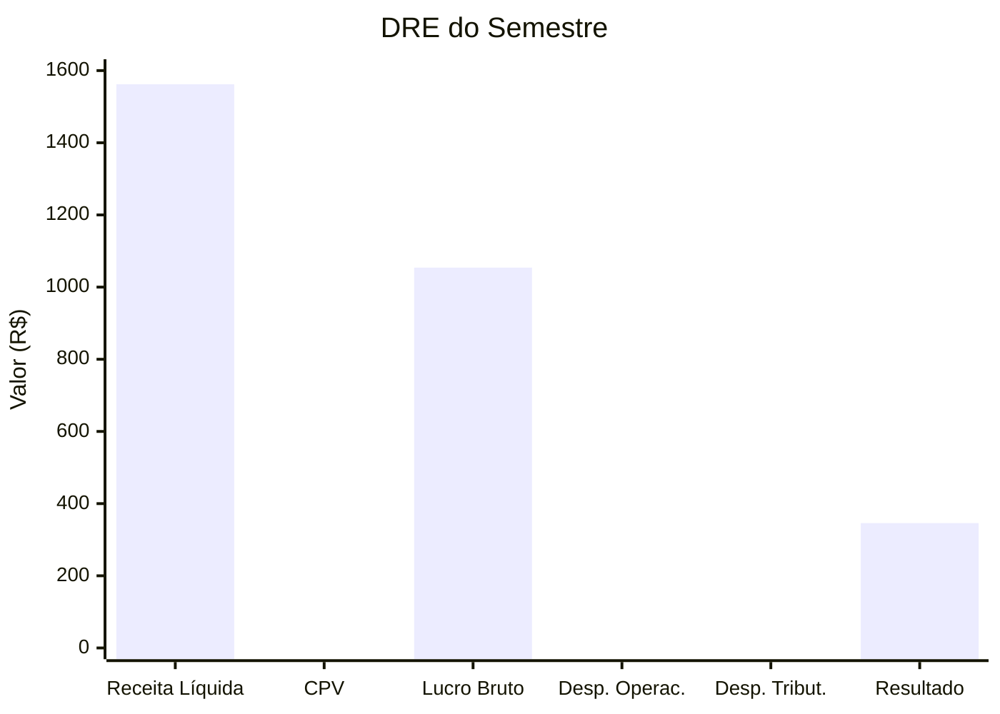

# 6.6 — Apresentação dos Resultados

## Objetivo

Consolidar todo o trabalho em uma apresentação executiva simulando uma reunião de diretoria.

## Estrutura da Apresentação

### Slide 1: Capa
**Análise Financeira Grupo Nova Era S.A. — 1º Semestre 2026**

### Slide 2: Resumo Executivo
```
📈 Receita Total: R$ 1.562.200 (+8,3% vs semestre anterior)
💰 Margem Líquida: 12,4%
🏦 Saldo de Caixa Projetado: R$ 157.800
⚠️ Inadimplência: 4,2% (controlado)
✅ Principal Risco: Concentração em 2 clientes (35% da receita)
```

### Slide 3: Desempenho Comercial
- **Top 3 clientes**: MetalTech, Hospital São Lucas, Supermercados Economia
- **Cliente que mais cresceu**: MetalTech (+15% mês a mês)
- **Produto estrela**: Equipamentos Hospitalares (maior margem)
- **Segmento líder**: Indústria Metalúrgica (28% da receita)

### Slide 4: DRE do Semestre
Gráfico waterfall mostrando:



Receita Líquida R$ 1.562.200 | CPV R$ 508.000 (32,5%) | Lucro Bruto R$ 1.054.200 (67,5%) | Desp. Operac. R$ 593.500 (38,0%) | Desp. Tribut. R$ 115.000 (7,4%) | Resultado R$ 345.700 (22,1%)

### Slide 5: Fluxo de Caixa
- Saldo atual: R$ 85.000 (estimado)
- Próximos 30 dias: entrada prevista de R$ 327.300, saída de R$ 169.500
- **Saldo projetado em 30 dias: R$ 242.800** 👍
- Necessidade de captação: NÃO (caixa positivo)

### Slide 6: Riscos e Oportunidades

| Risco | Probabilidade | Impacto | Ação |
|-------|--------------|---------|------|
| Concentração MetalTech | Média | Alto | Diversificar carteira |
| Atraso Hospital S. Lucas | Alta | Médio | Reforçar cobrança |
| Aumento aço carbono | Média | Alto | Hedge de compras |
| Inadimplência subindo | Baixa | Médio | Revisão de crédito |

### Slide 7: Recomendações

1. **Comercial**: Buscar novos clientes no segmento de saúde (menos concentração)
2. **Cobrança**: Implementar desconto para pagamento antecipado
3. **Suprimentos**: Negociar contratos longos de aço para travar preço
4. **TI**: Automatizar classificação de despesas com IA (economia estimada: 40h/mês)
5. **Processos**: Criar alerta automático para contas a pagar com vencimento próximo

## Roteiro da Reunião (15 min)

| Minuto | Tópico |
|--------|--------|
| 0-2 | Contexto e objetivos da análise |
| 2-5 | Destaques do semestre (KPIs) |
| 5-8 | DRE e rentabilidade |
| 8-10 | Fluxo de caixa e projeções |
| 10-12 | Riscos identificados |
| 12-15 | Recomendações e próximos passos |

## Critérios de Avaliação

| Critério | Peso | O que será avaliado |
|----------|------|---------------------|
| SQL | 30% | Queries corretas, otimizadas, bem estruturadas |
| Análise | 25% | Profundidade dos insights, relevância para negócio |
| Visualização | 20% | Clareza dos dados, escolha do gráfico adequado |
| Apresentação | 15% | Organização, clareza, storytelling |
| Técnica | 10% | Uso de CTEs, window functions, joins |

## Checklist Final

- [ ] Todas as queries SQL funcionam no playground
- [ ] KPIs calculados e conferidos
- [ ] DRE fechou (diferença < R$ 1,00)
- [ ] Fluxo de caixa projetado está coerente
- [ ] Riscos identificados com dados
- [ ] Recomendações são acionáveis
- [ ] Apresentação tem começo, meio e fim

## Parabéns! 🎉

Você completou o curso! Agora você é capaz de:

- **Extrair** dados financeiros com SQL de qualquer sistema
- **Processar** grandes volumes no BigQuery
- **Visualizar** KPIs em Looker e Tableau
- **Prever** tendências com Machine Learning
- **Automatizar** classificações e detecções com IA

Você saiu da controladoria tradicional e entrou na **controladoria 4.0**.

import Quiz from '@site/src/components/Quiz'
import quizes from '@site/src/components/Quiz/quizData'

<Quiz moduleId="modulo6" title={quizes.modulo6.title} questions={quizes.modulo6.questions} />
